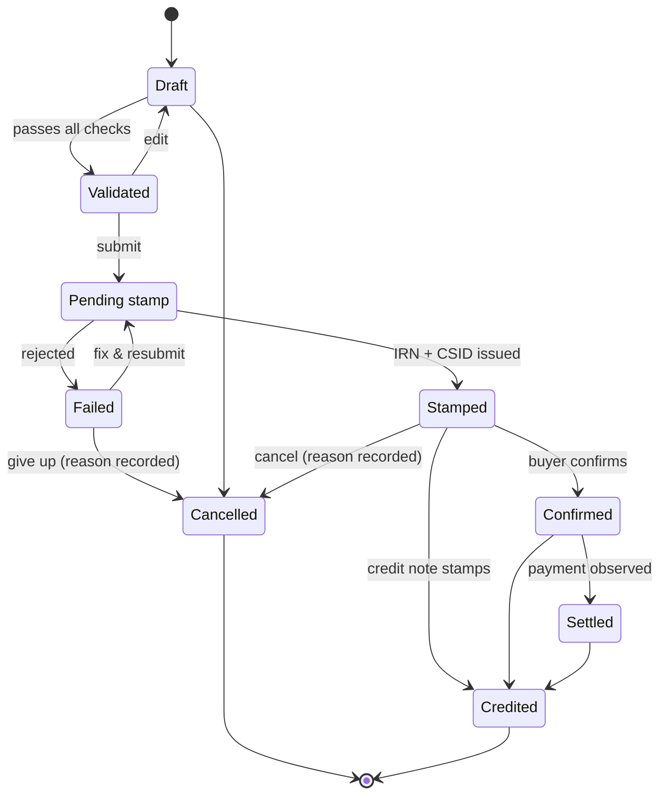

# MeridianIQ — User Manual

*One data spine. Five ways in.*

This manual explains everything MeridianIQ does and how to use it — written
for the people who use it every day (SME owners, accountants, buyer finance
teams, Compliance Desk operators, auditors) with a final section for whoever
runs the system.

---

## Contents

1. [What is MeridianIQ?](#1-what-is-meridianiq)
2. [Quick start: signing in](#2-quick-start-signing-in)
3. [Who sees what: the six account types](#3-who-sees-what-the-six-account-types)
4. [The Compliance App — for SMEs](#4-the-compliance-app--for-smes)
5. [Clerk — the AI assistant](#5-clerk--the-ai-assistant)
6. [The Accountant Console — for firms](#6-the-accountant-console--for-firms)
7. [The Compliance Desk — for operators](#7-the-compliance-desk--for-operators)
8. [Buyer Rails — for buyer finance teams](#8-buyer-rails--for-buyer-finance-teams)
9. [The Penalty Calculator — free and public](#9-the-penalty-calculator--free-and-public)
10. [The Mobile Companion](#10-the-mobile-companion)
11. [The life of an invoice](#11-the-life-of-an-invoice)
12. [Feature flags: why some pages say "not yet enabled"](#12-feature-flags-why-some-pages-say-not-yet-enabled)
13. [Consent and your data](#13-consent-and-your-data)
14. [For administrators](#14-for-administrators)
15. [Troubleshooting & FAQ](#15-troubleshooting--faq)
16. [Glossary](#16-glossary)

---

## 1. What is MeridianIQ?

Nigeria's tax authority requires businesses to submit their invoices to the
national e-invoicing platform for validation **before** the buyer acts on
them. A validated invoice receives an official stamp — an IRN, a CSID and a
QR code. Missing the submission window, or submitting invoices the platform
rejects, attracts penalties.

MeridianIQ makes that painless, and then makes it worth more:

- **For SMEs** — guided invoicing that catches errors *before* submission,
  automatic transmission with retries, a permanent vault of stamped invoices,
  deadline alerts, receivables tracking, and an AI assistant ("Clerk") that
  reads supplier documents and answers questions from your own records.
- **For accounting firms** — one screen showing penalty risk across the whole
  client book, plus onboarding, billing, advisory tools, VAT filing packs,
  white-label branding, and an API for connecting the firm's own software.
- **For big buyers** — a workflow to verify supplier invoices (protecting the
  buyer's input-VAT position) and confirm them formally.
- **Underneath it all** — every submission, confirmation and settlement is
  recorded once, immutably, with consent attached. Today that record keeps
  you compliant; one day it can make your invoices financeable.

Everything runs in one place, reached through **one front door** — plus a
mobile companion app:

| Address | Workspace | For |
|---|---|---|
| `/` | **The Portal** — sign in, pick a workspace | Everyone |
| `/app/` | **Compliance App** | SME owners, firm staff |
| `/console/` | **Accountant Console** (incl. the Compliance Desk) | Firms, operators, auditors |
| `/buyer/` | **Buyer Rails** | Buyer finance teams |
| `/penalty-calculator/` | **Penalty Calculator** | Anyone — no account needed |
| Mobile app | **MeridianIQ Companion** (iOS/Android) | SME owners, firm staff on the go |

---

## 2. Quick start: signing in

### The portal

Open the public site at `/` and choose **Sign in**, or go directly to
`/login`. You'll see the workspace tiles and a **Sign in** panel. One sign-in
unlocks every workspace your account is allowed to use — after signing in you
are taken straight to your main workspace, and the tiles you can open are
highlighted.

### Demo accounts

Every demo account uses the password **`meridian2027`**. On the portal,
clicking a demo account name signs you in with one click. (Demo accounts
exist only on deployments seeded with demo data — see
[section 14](#14-for-administrators).)

| Account | Email | Signs you into |
|---|---|---|
| SME owner (Adaeze Foods) | `owner@adaezefoods.example` | Compliance App — owns the consent decisions |
| SME firm staff | `demo.staff@meridianiq.example` | Compliance App, with live demo data |
| Accountant (firm admin) | `demo.admin@meridianiq.example` | Accountant Console (and the Compliance App) |
| Compliance Desk operator | `ops@meridianiq.example` | The operator queue in the Console |
| Buyer finance (Zenith Retail) | `finance@zenithretail.example` | Buyer Rails |
| Read-only auditor | `audit@meridianiq.example` | Audit & evidence (read-only Console) |

Two further accounts are seeded but not shown as buttons: a second buyer
(`accounts@saharalogistics.example`) and a second operator
(`claims.approver@meridianiq.example`) — the latter exists so the claims
register's maker-checker rule (you cannot approve your own draft) can be
exercised in the demo.

### Signing out

Every workspace has a **Sign out** button at the bottom of its left sidebar
(next to **All apps**, which takes you back to the portal). Signing out ends
the session everywhere.

### Changing your password

On the portal, while signed in, your account card has a **Change password**
form. You must enter your current password; the new one needs at least 8
characters. Changing your password signs out every *other* session on your
account (the device you changed it from stays signed in), and the change is
recorded on the audit trail.

### Forgot your password?

Use **Forgot your password?** on the sign-in panel. Resets are issued as
one-time links: ask your firm administrator — or MeridianIQ support — to send
you one, then open it and choose a new password (at least 8 characters). The
link works once, expires after 24 hours, and signs out every other session on
your account. Operators issue reset links from **Console → Team invitations**.

### Two-factor authentication (2FA)

Any account can protect itself with an authenticator app (Google
Authenticator, Aegis, 1Password — anything that speaks standard TOTP codes).
Deployments can also *require* 2FA for chosen roles (typically operators and
firm admins) — a required-but-unenrolled account is refused at sign-in with
instructions to enrol first.

**Turning it on** — on the portal, while signed in, the account card has a
**Two-factor authentication** section:

1. Click **Enable two-factor**. You are shown — exactly once — a secret and
   a setup link: paste the setup link into your authenticator app (or type
   the secret in manually), plus **8 recovery codes** (10 characters each).
   **Copy the recovery codes somewhere safe now** — each one signs you in
   exactly once if you ever lose your authenticator, and they are never
   shown again.
2. Enter a live 6-digit code from the app to **activate**. From that moment
   sign-in demands the code, and every *other* session on your account is
   signed out.

**Signing in with 2FA** — after your password is accepted you see the
**"Enter your code"** screen. Codes rotate every 30 seconds; a recovery code
works here too. The code prompt is valid for 5 minutes — after that, start
over with your password. Five failed code attempts within 15 minutes locks
the challenge until the window passes.

**Turning it off** — the same card has **Turn off two-factor**; it demands
your current password *and* a live code (or a recovery code), and signs out
every other session.

> The mobile companion app does not yet support the 2FA challenge — if your
> account has 2FA enabled, sign in through the web workspaces.

### Security you'll notice

- Wrong email or password always produces the same message — the system never
  reveals whether an email exists.
- **Five failed attempts within 15 minutes** locks that email (from your
  network) out of sign-in until the window passes; a second, account-wide
  counter (50 failures per hour, from anywhere) blunts distributed
  password-guessing without letting a stranger cheaply lock you out. If you
  see *"Too many sign-in attempts"*, wait the indicated time and try again.
- Sessions last 7 days, in a secure browser cookie.
- The API rate-limits every account (600 requests/minute in general, 60/minute
  on AI-powered routes). Normal use never touches these ceilings; scripts
  might — the response says how long to wait.

---

## 3. Who sees what: the six account types

MeridianIQ enforces permissions at every level — the menus you see, the pages
you can open, and the data the server will return.

| Role | Plain-language description |
|---|---|
| **Client user** | The SME itself (e.g. the business owner). Creates and submits its own invoices, and is the account that grants or revokes **consent** over the business's data. |
| **Firm staff** | An accountant working clients' books. Everything the client can do (except consent decisions), plus firm-wide views. |
| **Firm admin** | Runs the practice. Everything staff can do, plus onboarding pipeline management, billing & payments, white-label branding, ERP integrations, client import, team invitations, and the firm's API keys & webhooks. |
| **Operator** | MeridianIQ's own Compliance Desk. Works a cross-tenant case queue, reviews Clerk's document extractions, edits the error catalogue, manages platform health, feature flags and party data. Does **not** see firm business pages like the portfolio. |
| **Buyer user** | A finance person at a large buyer. Sees only invoices addressed to their own organisation. |
| **Auditor** | Read-only everything. Can view every screen the numbers live on, and can verify/export the audit log — but every button that would change something is absent or refused. |

If you open a page your account can't use, you get a clear card explaining
which permission it needs — never a broken screen.

(There is a seventh, non-human identity: a firm **API key**, used by software
the firm connects. It carries only the capabilities the firm admin granted it
— see [section 6](#6-the-accountant-console--for-firms) → API & webhooks.)

---

## 4. The Compliance App — for SMEs

Sign in as the SME owner or firm staff and you land at `/app/`. The sidebar:
**Dashboard, Invoices, Recurring, Import, Send to Clerk, Ask Clerk,
Reconciliation, B2C reports, Calendar, Alert settings, Consent** (the two
Clerk entries appear only for accounts with Clerk access). A **notification
bell** in the header collects every alert the platform has sent you — see
"Notifications" below.

### Dashboard

Four tiles summarise the book at a glance — **Pending invoices** (submitted,
awaiting stamping), **Stamped & valid**, **Drafts**, and **At risk** — plus a
set of cards that appear as their data becomes relevant:

- **Recent activity** and **Next deadline**.
- **Receivables** — the money owed to you: total outstanding, aging buckets
  (**Current ≤30d / 31–60 / 61–90 / 90+ days**), and your top debtors, each
  with a "usually pays ~N days" chip once enough payment history exists.
  **Export CSV** downloads the aging detail.
- **Expected inflows** — projected cash arrivals by week, from each buyer's
  own payment rhythm (with an accuracy line once the projection has a track
  record), and **Worth chasing** — outstanding invoices ranked by how far
  past *that buyer's* usual payment time they are, each with a **Chase**
  shortcut.
- **Money you usually bill** — months where a customer you normally invoice
  hasn't been invoiced yet ("Draft invoice" raises it), and **Money in with
  no invoice** — bank credits on reconciled statements with no invoice
  behind them ("Raise invoice").
- **Your week** (firm accounts) — Clerk's weekly digest, and **Your
  compliance month** (client accounts) — Clerk's monthly statement for the
  business. Both appear only when their features are switched on
  ([section 5](#5-clerk--the-ai-assistant)).

### Creating an invoice

**Invoices → New invoice.** The guided form asks for the customer, dates, and
line items (description, quantity, unit price, VAT rate). Totals and VAT are
computed for you, and a **Compliance check** panel ticks off every
requirement (invoice number, customer, customer TIN, complete lines, VAT
rate) before **Create invoice** is offered.

- **Draft with Clerk** — type one sentence ("Invoice Adaeze Foods ₦150,000
  for June deliveries, 7.5% VAT") and Clerk prefills the form. You review
  every field before saving; nothing is created until you do.
- **Add customer** — a dialog right on the form (legal name, optional TIN /
  street / city), so a new buyer never blocks an invoice.
- **Frequent items** — chips mined from your own past invoices; one click
  appends a prefilled line.
- Your work is auto-saved as a draft in the browser, so a dropped connection
  never loses a half-entered invoice.

### The invoice vault

**Invoices** lists everything, write-once and searchable:

- **Search** by invoice number or customer name; **filter pills** (All /
  Unsubmitted / Pending / Stamped / Failed) with live counts; advanced
  **Filters** (issue-date range, amount range). Lists load 50 at a time with
  **Load more**.
- **Export CSV** downloads the (filtered) list.
- **Submit all drafts** validates every pending draft (oldest first) and
  submits the valid ones in batches of up to 200, with a per-invoice results
  report — every invalid or failed row links to the invoice with the reason.

### On an invoice

- **Submit for stamping** validates it and queues it for transmission.
  Stamping is **asynchronous** — the invoice shows **Pending stamp** until
  the national platform answers. Transmission is reliable by design:
  automatic retries with backoff, duplicate protection (retrying can never
  create two stamps), and automatic failover to a second transmission rail.
- **Download PDF** — every invoice has a PDF. Unstamped invoices carry a
  watermark; stamped invoices carry an **"FIRS stamped"** block with the
  IRN, CSID and a **QR code** anyone can scan to verify the stamp.
- **Compliance status** — a green/amber/red light with plain-language
  reasons and a recommended action.
- **Rejection risk** (drafts) — before you submit, a card lists the ways
  invoices *like this one* (same supplier, same buyer, your firm's common
  codes) have been rejected recently. History, not prediction.
- **Awaiting payment** (stamped invoices past their terms) — **Draft a
  payment reminder** has Clerk phrase a polite chaser from the invoice's
  facts and the buyer's payment rhythm. You copy it into your **own** email
  — the platform sends nothing. Copying logs the reminder, and the next
  draft's tone escalates politely (warm → firm → "confirm a payment date").
- **New from this invoice** — copies the customer and lines into a fresh
  draft.

### When a submission fails

A failed invoice shows a plain-language explanation drawn from the **error
catalogue**: what the rejection code means, what caused it, and how to fix
it. From there you can:

1. **Fix & resubmit** — the failed invoice is editable in place; the fields
   the error implicates are highlighted.
2. **Explain in plain language** — Clerk rephrases the catalogue entry for
   this specific invoice.
3. **Escalate to my firm** — describe what you already tried and send it.
   The escalation lands directly in the **Compliance Desk operator queue**
   with your notes attached; when the Desk answers, the reply appears on the
   invoice ("Compliance Desk replied").

### Cancelling and credit notes

Mistakes after stamping are handled formally, never by editing history:

- **Cancel invoice** (available before settlement) — records a cancellation
  with your stated reason. A cancelled invoice is terminal and can never be
  presented as valid again.
- **Issue credit note** (for stamped/confirmed/settled invoices) — creates a
  credit note (numbered `CN-<original number>`) that is itself submitted and
  stamped. **When the credit note stamps, the original automatically becomes
  Credited** — a terminal state. Only one live credit note may exist per
  invoice.

Both actions require a reason, which is recorded on the permanent ledger.

### Requesting buyer confirmation

On a stamped invoice, **Request confirmation** asks your buyer to formally
confirm it inside Buyer Rails. The confirmation timeline on the invoice shows
every response (confirmed / queried / rejected). A confirmed invoice is worth
more than a stamped one — it's the buyer saying *"yes, we owe this."*

### Recurring invoices

**Recurring** holds standing templates that turn into ordinary draft invoices
on schedule (weekly or monthly) — you review and submit each generated draft
like any other. The page also **suggests** recurring setups ("Looks like you
bill these customers about monthly") mined from your own invoice history;
accepting a suggestion prefills the template dialog. Templates can be paused
and resumed.

### Importing invoices in bulk

**Import** accepts the published CSV/Excel template — download either from
the page. Columns:

```
invoiceNumber, buyerName, buyerTin, issueDate, dueDate,
description, quantity, unitPrice, vatRate, currency
```

**Validate rows** previews every row's result before **Import valid rows**
creates anything; imports up to **5,000 rows** are processed with a per-row
result — every rejected row tells you why, and nothing is half-imported
silently.

### Reconciliation *(feature-flagged)*

**Reconciliation** matches your bank statement against your stamped invoices:

1. **Add a statement** — upload a CSV (GTBank, Zenith, Access and generic
   exports are recognised; your firm can also register custom formats), paste
   CSV text, **or upload a scanned PDF statement**. A PDF takes the Clerk
   path: **Check parsing** has Clerk read the pages into proposed statement
   rows, the parse report shows *exactly* the rows that will be saved
   ("Clerk read this scanned statement — check the dates, amounts and
   directions… nothing is saved until you press Commit"), and **Commit
   statement** commits precisely those previewed rows — never a re-read.
2. The matcher proposes matches with a confidence score.
3. **Accept** a proposal and the invoice is marked **Settled** with the bank
   line as evidence; reject and it's dropped. When several high-confidence
   proposals are waiting, **Accept all ≥ 85% (N)** takes the best proposal
   per statement line in one action (click twice — it asks you to confirm).
   For a low-confidence match, **Why this match?** has Clerk explain the
   candidate comparison — accepting stays your decision.

This is the honest way an invoice becomes "paid" in MeridianIQ — a real,
source-tagged settlement event, never a manual tick-box.

### B2C reports *(feature-flagged)*

B2C sales above ₦50,000 must be reported within **24 hours**, with a daily
penalty for lateness. The **B2C Reports** page shows each day's batch with a
live countdown clock (`Xh Ym left to report`), the items inside it, and its
report status. Batches at risk of breaching alert you before the deadline,
not after.

### Calendar and alerts

- **Calendar** — every compliance deadline for your business: invoice
  submission windows, B2C report windows, penalty-watch items.
- **Alert settings** — choose the channels (WhatsApp / SMS / email) for
  urgent alerts, enter the contact details for each, pick what to be alerted
  about (deadline reminders, submission failures, penalty watch), and send
  yourself a test. Privacy rule: alert messages are **pointers only** — they
  never contain amounts, names, or documents, just "you have N items to
  review" with a link into the app.
- **Notifications (the bell)** — every alert sent to you also lands in the
  in-app inbox: the bell shows an unread count (capped at "20+"), unread
  rows are highlighted, and **Mark all read** clears them. Each row shows
  which channel carried it (Email / Push / SMS / WhatsApp) and when.

### Consent

The **Consent** page shows the three permission layers over your business
data, each grantable and revocable **by you** (the client account):

1. **Compliance & submission** — lets MeridianIQ validate, submit, vault and
   alert. Without it, nothing can be submitted on your behalf.
2. **Anonymized benchmarking** — allows anonymized, aggregate industry
   statistics. Never shown with your name.
3. **Credit readiness** — dormant. One day your compliance history could help
   you get paid early against invoices you've already earned; that layer
   activates later, and only with your explicit consent.

Every grant and revocation is a **ledger event** with a full history —
revoking takes effect immediately.

---

## 5. Clerk — the AI assistant

Clerk is MeridianIQ's built-in assistant. One principle governs everything it
does: **Clerk never files anything.** It reads documents and proposes; a
human reviews and decides; approval creates a *draft* invoice only. Numbers
in its answers are computed from your own records by the platform — the AI
only classifies and phrases. Every Clerk surface sits behind a platform-wide
kill switch the operator can flip, and every call it makes is metered against
your firm's monthly allowance.

### Sending documents to Clerk

**Send to Clerk** (in the SME app, the mobile app, and the operator console)
accepts a supplier invoice as:

- a **PDF or photo** (PNG/JPEG/WebP, up to 5 MB) — including **scanned**
  PDFs with no text layer;
- a **voice note** (up to 5 MB — English; the audio is transcribed and only
  the transcript is kept);
- **pasted text**;
- a **multi-invoice bundle** — tick "This contains multiple invoices" to
  have a month-end stack (pasted text, a text PDF, or a scanned bundle of up
  to 24 pages) split into individual invoices and queued, up to 50 at a
  time, with a live progress card.

A duplicate guard recognises documents Clerk has already seen ("Already sent
this one?") so a re-forwarded email never creates two cases. Your
**submissions list** shows each item's status — *Clerk is reading… →
extracted (your accountant reviews everything before anything is created) →
approved ("Draft invoice created") or failed (with the reason)* — including
a "What Clerk read" table of every extracted field.

### Forwarding by email or WhatsApp

Deployments can switch on two hands-free intake rails (each is dark until
its administrator configures it — [section 14](#14-for-administrators)):

- **Email** — forward a supplier invoice (PDF/image attachments) from the
  email address you sign in with; each attachment walks the ordinary capture
  path above.
- **WhatsApp** — send the document (or a text message of the invoice) from
  the WhatsApp number saved in **Alert settings**. For safety, only a number
  the client account entered *itself* routes documents — a number typed in
  by firm staff is never used as an identity. If a number matches more than
  one business, the message is refused rather than guessed.

Both rails have per-firm daily caps, and everything they ingest still waits
for human review — nothing files itself.

### Review and approval (accountants & operators)

Captured documents queue for human review (in the console's **Clerk → Intake
queue**). The reviewer sees every extracted field with its confidence, the
source snippet it came from, "historically corrected" hints on fields Clerk
tends to get wrong for you, a **pre-flight** check (duplicate invoice
numbers, VAT-rate deviations, suspicious dates or amounts against that
supplier's own history), and party suggestions from the register (a
"Remembered" chip means the match comes from a previously confirmed
pairing). Approval **always creates a draft invoice** — submission to the
rails stays a separate human action.

Cases that pass pre-flight cleanly with high confidence form the **fast
lane**: *Approve fast lane (N)* approves them in bulk — the server
re-verifies every case before touching it, and anything not genuinely
fast-lane is skipped with its reason.

### Ask Clerk

**Ask Clerk** answers two kinds of questions, and refuses everything else
rather than improvising:

- **Rules** — "What VAT rate applies to a consulting invoice?" Answers come
  verbatim from the **claims register**: a store of approved statements,
  each with protected facts, a citation and a review date, maintained under
  maker-checker discipline (the person who drafts a claim can never approve
  it). The answer names the claim and version it came from.
- **Your own numbers** — "What's overdue?", "What did we submit this
  month?", "Who owes us?", "What's expected this week?", "Who's worth
  chasing?" The platform runs a fixed query over your own records and Clerk
  phrases the result; the source line says exactly what was computed and for
  which month/client. Follow-ups thread ("and for June?").

Client accounts can ask too — pinned to their own business, with the
firm-wide questions excluded. Refused questions aren't wasted: the console
mines them into a "register gaps" list, so the firm can see which claims to
draft next.

### Digests, statements and drafting helpers

- **Weekly firm digest** *(opt-in)* — a short Monday briefing per firm:
  submissions, failures, money expected this week, who's worth chasing,
  unbilled habits, unmatched credits. Every fact is computed from your
  records; Clerk only phrases them. Staff opt in individually (**Your
  notifications** card on the console portfolio — email delivery requires a
  verified address; a 6–8 character code confirms it).
- **Monthly client statement** *(opt-in)* — a per-client compliance summary
  of each closed month, shown on the SME dashboard and offered over the
  alert rails (with the client's layer-1 consent).
- **Drafting helpers** throughout the product follow the same pattern —
  facts computed by the platform, Clerk phrases, you own the text, a plain
  template answers even when Clerk is off: the payment-reminder draft, the
  failure explainer, advisory client letters, VAT-pack and quarterly cover
  notes, error-catalogue entries, custom statement-format mappings,
  client-import column mappings, and the Desk's escalation replies.

### Allowance & the kill switch

Each firm has a monthly Clerk token allowance (set by tier). The **Send to
Clerk** page shows a live meter ("Clerk allowance: N% used this month") with
a pace warning before the cliff and a per-purpose breakdown of where the
tokens went. When the allowance is exhausted, Clerk surfaces answer with the
deterministic fallback (or a clear "try next month") — manual flows are
never blocked. The operator can switch every Clerk surface off instantly via
the `clerk_ai` feature flag; the product keeps working without it.

---

## 6. The Accountant Console — for firms

Sign in as the firm admin and you land at `/console/` on the **Portfolio**.
The sidebar is grouped: **Practice** (Portfolio, Onboarding, Client import,
Advisory, Team invitations, Integrations, API & webhooks), **Growth &
revenue** (Plans & billing, Statements, Unearned income, White-label,
Certification), and **Platform** (the operator/auditor pages, plus Feature
flags and the Claims register, which firm accounts can read). A
**notification bell** in the header works exactly as in the SME app.

### Portfolio

The whole client book, ranked by penalty risk:

- **High risk** (red) — overdue unsubmitted invoices, or more than one failed
  submission. Act today.
- **Medium risk** (amber) — a failure to resolve, or a submission window
  closing within 3 days.
- **Low risk** (green) — compliant.

The summary tiles show client count, high-risk count, unsubmitted invoice
value, and overdue deadlines. Click any client to drill down to their full
invoice list — a partner can reach any failing invoice in three clicks.

Below the client list, the portfolio gathers the firm-wide working cards
(each appears when its data exists), grouped under anchor chips **Clients /
Money / Compliance / Connections & delivery**:

- **Receivables** — outstanding money per client and currency, with 90+-day
  and oldest-due columns and top debtors.
- **Billing statement** — what MeridianIQ charges the firm each closed
  month: accepted invoices, Clerk usage (with a by-purpose breakdown), base
  fee, overage, total — exportable as CSV. The **Payments** section collects
  it: **Record payment intent — \<month\>** computes the month's fee
  server-side and (when a payment provider is configured) opens a hosted
  **checkout** link; the intents list shows each payment's status (Pending /
  Confirmed / Failed / Cancelled). One live payment per month — trying again
  says "already in motion".
- **VAT filing pack** — per-month accepted-invoice totals for the VAT
  return, with CSV export, a Clerk-phrased **cover note** you edit and own,
  and a **settlement cross-check** (which of the month's invoices the
  platform has *observed* being paid — an assurance view, never an
  accusation).
- **Quarterly review** — a closed quarter in one document: the three monthly
  VAT packs, submission outcomes and top rejection codes, a receivables
  snapshot, Clerk throughput, and its own cover note.
- **Compliance calendar** — the month ahead of statutory deadlines across
  every client, from the same clocks each client's dashboard shows.
- **Recurring rejection causes** — the firm's own failed submissions
  clustered into catalogue-grounded causes, with trend.
- **Clerk adoption & impact** — per-client capture volume, kept-rate and
  review turnaround: the renewal-conversation numbers.
- **Bank-feed connections** *(feature-flagged)* — scheduled statement pulls
  per client through a registered connector: create a connection, **Sync
  now**, and inspect each run (started / status / lines). Pulled statements
  land through the ordinary reconciliation path.
- **Weekly digest** and **Your notifications** — see
  [section 5](#5-clerk--the-ai-assistant).

### Onboarding pipeline

A simple stage board for prospective clients: **lead → contacted → proposal →
onboarding → active** (or lost). Each prospect records estimated monthly
invoice volume, which powers the next view.

### Unearned income

For every eligible prospect not yet converted, this view computes the
billing and revenue share the firm is leaving on the table at current tiers —
reconciled to the naira with the billing module. It is the "why finish
onboarding" screen.

### Advisory toolkit

Two revenue-earning instruments, both writing their findings into the client
record:

- **Readiness assessment** — pick a client, answer the yes/no questionnaire
  (weighted questions across systems, records and process), and get a scored
  gap report (`ready / partial / at_risk`) with a prioritised remediation
  plan.
- **VAT-risk check** — paste a buyer's supplier ledger as CSV (columns are
  matched loosely: invoice number, supplier TIN, supplier name, IRN, CSID,
  invoice amount, VAT amount). Every row's stamp is verified against the
  national system, and the report totals the **input VAT at risk** from
  invalid supplier invoices.

Both offer a Clerk-drafted **client letter** from the stored findings — you
edit and send it yourself; nothing is stored or sent by the platform.

### Team invitations

Firm admins invite their own team from **Team invitations**: enter an email
and role (firm admin, firm staff, or a client user tied to a chosen client),
and send. The invite link is **shown once** — copy it and pass it on; it
expires after 7 days and works once. The invitee opens it, sets a password
(8+ characters), and signs straight in. Pending invitations can be revoked.

### Plans & billing

The four commercial tiers, with per-tier pricing, included invoice volume,
overage price and revenue-share percentage:

| Tier | Monthly | Included invoices | Overage | Revenue share |
|---|---|---|---|---|
| Essential | ₦15,000 | 50 | ₦120 | 10% |
| Compliance Desk | ₦45,000 | 200 | ₦100 | 15% |
| Professional | ₦120,000 | 750 | ₦80 | 20% |
| Enterprise-lite | ₦350,000 | 3,000 | ₦55 | 25% |

Firm admins can switch the firm's subscription; tier parameters themselves
are edited under a **price review** discipline (every change recorded with
history, not a silent overwrite — tier edits are an operator action).

### Statements

Monthly revenue-share statements per firm: billed invoice count, subscription
+ overage, and the firm's share. Generate a period on demand and **export
CSV** for accounting. (This is the firm's *earnings* view; what the firm
*owes* MeridianIQ is the portfolio's billing statement card.)

### API & webhooks *(firm admin only)*

**API & webhooks** connects the firm's own software. Both credentials are
**shown exactly once** at creation — store them in a secret manager.

**API keys** — create a key with a name and a capability set; the only three
capabilities offered are deliberately narrow:

- **Read invoices** — pull invoice data and statuses.
- **Write draft invoices** — create and edit drafts. *Submission to the
  rails stays a human action* — no key can submit, and no key can touch
  Clerk, billing, or identity.
- **Push bank statements** — upload statement files for reconciliation.

The key (`mk_…`) is presented as `Authorization: Bearer mk_…` on the same
API the apps use. It is pinned to your firm, rate-limited on its own budget,
and revocable instantly — the list shows each key's prefix, capabilities and
last use.

**Webhooks** — register an HTTPS endpoint and subscribe to events:

- **Invoice stamped** — an invoice was accepted and stamped by the rails.
- **Invoice settled** — a payment was matched and the invoice settled.
- **Statement reconciled** — a bank statement finished its reconciliation
  pass.

Payloads are **pointer-only** (ids and timestamps — never amounts, names or
documents); fetch the details through the API with an API key. Every
delivery is signed: the `x-meridian-signature` header carries an HMAC-SHA256
of the raw body, keyed by the **SHA-256 hash of your signing secret** (hash
the stored `whsec_…` secret once, then verify each body against that key).
Failed deliveries retry with backoff up to 5 attempts, then park as **dead**;
the **Deliveries** view shows every attempt. Disabling an endpoint stops
deliveries but keeps its history.

### Client import *(feature-flagged)*

Bulk-import a client book from a practice-management export — a 200-client
book lands in one session, with per-row results. If your export's columns
don't match the template, **Draft with Clerk** proposes the column mapping —
verified against the headers that actually exist — and the import still runs
validate-then-commit.

### Integrations *(feature-flagged)*

Connect a client's accounting package (SagePro and QuickLite ship first) and
pull their AR invoices on demand. **Sync now** imports through the standard
path — validation still runs before anything is submitted. The page shows
each connection's status, last sync and any errors.

### White-label *(feature-flagged)*

Brand the workspace as your own: firm name, colours and a subdomain — live in
under a day, no per-firm deployment.

### Certification *(feature-flagged)*

CPD course content for firm staff: enrol in a course, work through its
modules, and complete it for the stated CPD hours. Progress per person is
tracked, and completions mint a certificate serial.

---

## 7. The Compliance Desk — for operators

Sign in as the operator and the console becomes the **Compliance Desk**: the
firm business pages disappear and the platform-operations pages appear. You
land directly on the queue.

### Operator queue

The heart of the managed service. A **"This morning"** brief opens the page:
open cases by priority (with the oldest named), unanswered escalations,
stuck batches, unmapped codes, yesterday's throughput, spend anomalies, and
a red line if Clerk is switched off or its injection resistance dropped.

Cases arrive automatically from three sources — no one has to file them:

1. **Client escalations** — when an SME clicks *Escalate*, the case appears
   with the client's own words attached ("what I already tried").
2. **Failed submissions** — when the pipeline gives up on an invoice
   (terminal rejection or exhausted retries), a case opens with the failure
   code.
3. **Unmapped error codes** — when a failure code appears that the error
   catalogue doesn't know, a case opens asking for a catalogue entry
   (within about a minute of the first sighting).

Each case card shows the firm, client and invoice, the priority, the
**playbook** for its error code (cause + fix from the catalogue), any client
escalation context, and — when the triage assistant is on — a violet **"Clerk
suggests"** routing proposal ("a proposal, not a decision"). The workflow:

- **Claim case** — takes it; the clock starts.
- **Retry & resolve** — for retriable errors, one click.
- **Resolve** — with an optional resolution note.
- On an escalation, **Draft reply** grounds a response in the catalogue and
  the invoice's real attempt history; you edit, then **Send reply** — the
  client sees it on their invoice.

The stat tiles across the top — open, in progress, resolved, **clients
served**, **average handle time** — are the Desk's operating numbers. One
open case per invoice: repeat signals raise its priority instead of
duplicating it.

### Error catalogue

The living knowledge base behind every "here's what went wrong" message in
the product. Operators can search it, edit any entry's cause/fix/category,
mark codes retriable, and add new codes (**Draft with Clerk** grounds a
proposed entry in the observed rejections; you edit and save). A banner
lists **unmapped codes** seen on real submissions — one click pre-fills a new
entry — and a **coverage card** measures the share of rejection traffic the
catalogue maps, the age of unmapped debt, and the mapping SLA. The page also
manages **custom bank-statement formats**: paste a sample, let Clerk draft
the column mapping, validate against the real parser, save.

### Party integrity

Clean counterparty data, which everything downstream depends on:

- **Duplicate candidates** — parties sharing a TIN or a near-identical name,
  grouped. Pick the surviving record and **merge** — each candidate shows a
  "Carries: …" impact line (invoices, engagements, logins, aliases…) so you
  choose the survivor with evidence. History is preserved (nothing is
  deleted) and a wrong merge can be **split back out**.
- **TIN validation** — parties without a validated TIN are listed; they
  cannot enter the confirmation workflow until fixed.

### Platform ops

Live health of the machinery:

- **Submission rails** — each transmission rail's circuit-breaker state
  (Healthy / Half-open / Circuit open) and recent failure count.
- **Dead-lettered events** — queued work the pipeline gave up on, with the
  error and a **Replay** button.
- **Reconcile pipeline** — one click re-queues anything stuck.
- **Message deliveries** — every outbound alert (template, channel,
  failover, delivery status), once notifications are switched on.

### Gate metrics

The roadmap's release gates, measured live from real data: subscribed firms,
median time-to-stamp (target: under 48 hours), failure self-resolution rate
(target: 80%+ without escalation), credit-observable businesses,
confirmations per 30 days, reconciliation accept rate. Releases unlock on
evidence — this page **is** the evidence.

### Feature flags

Every release-gated capability, grouped by release (R0–R4), each with a
switch. Turning a flag on makes its surface live for every firm instantly;
off makes it unreachable (the pages answer "not yet enabled"). Only the
operator can flip flags — firm admins and auditors see this page read-only.

### Audit & evidence

The tamper-evident audit log, live:

- **Chain verified** — every recorded event hash-chains to the previous one;
  altering or deleting any row would break every link after it, and this page
  proves the chain end-to-end on demand.
- **Download audit bundle** — a self-contained export (all events + the
  verification result) that a regulator, bank or acquirer can re-verify
  independently, plus a CSV ledger export.
- **Full-firm data export** — operators and auditors can pull a complete,
  sectioned export of one firm's data through the API
  (`GET /api/firms/{id}/export`); the export itself is recorded on the audit
  trail (row counts only — the audit never contains the content).

### Team invitations (operator view)

Operators use the same **Team invitations** page as firm admins, with two
extras: they pick (or provision) the **target firm** for each invite, and
they issue **password-reset links** — single-use, 24-hour, shown once.

### Clerk operations

The **Clerk** rail (Intake queue, Claims, Ask Clerk, Health) is the
operator's side of [section 5](#5-clerk--the-ai-assistant). Beyond review
and the claims register, the **Health** page carries the operating evidence:
volume/latency/cost tiles, confidence calibration, per-field and per-supplier
correction patterns, kept-rate and injection-resistance trends with alert
banners, unit economics per purpose, the **evaluation corpus** (run an eval
on demand; retire/restore grown and red-team fixtures), and **canaries** —
try a candidate system prompt or a candidate model side-by-side against the
incumbent on the same fixtures, and only promote on evidence. A watchdog
sweep trips the kill switch automatically if extraction quality collapses.

---

## 8. Buyer Rails — for buyer finance teams

Sign in as a buyer and you land at `/buyer/`. *(Feature-flagged — the
operator switches Buyer Rails on.)* A buyer account sees **only invoices
addressed to its own organisation**. Three pages: **Confirmations,
Suppliers, Scoreboard**.

### Confirmations

The queue of supplier invoices awaiting your response. Open one and choose:

- **Confirm** — "we received this and it is correct." Optionally tick the
  **no-set-off acknowledgment** (a formal statement that you won't offset
  this invoice against counterclaims — which is what makes it financeable
  later).
- **Query** — send it back with a question; the supplier can correct and
  re-request.
- **Reject** — with the reason recorded.

Every response records who confirmed and how, permanently. Confirming is in
your own interest: your input-VAT claim rests on valid supplier invoices.

### Suppliers

Continuous verification across your supplier base: which suppliers' invoices
carry valid stamps, and your **input-VAT exposure** from ones that don't —
refreshed daily.

### Scoreboard

Your suppliers ranked by compliance and confirmation status — exportable for
procurement conversations.

### Payment flags

On an invoice, mark it **scheduled** or **paid**. A payment flag becomes a
settlement event on the supplier's record within a minute — the second
honest source (after bank-statement matching) of "this invoice was paid."

---

## 9. The Penalty Calculator — free and public

`/penalty-calculator/` needs no account and sends nothing to any server —
everything computes in your browser. Enter your annual turnover and
non-compliance inputs and it estimates exposure under:

- **s.103** — failure to grant systems access (a first-day amount plus a
  per-additional-day amount, banded by turnover), and
- **s.104** — non-compliant electronic invoices (a per-invoice amount, banded
  by turnover).

Use it as the "how bad could this get?" conversation starter. (The same
estimator ships inside the mobile app, equally offline.)

---

## 10. The Mobile Companion

The MeridianIQ Companion (iOS/Android, built with Expo) is the
on-the-go subset of the Compliance App for SME owners and firm staff. Sign
in with your normal email and password (firm users then pick which client
business to work in — switchable later from Settings). The app follows your
device's light/dark appearance, shows a "You're offline" banner when the
connection drops, and deep-links from push notifications straight to the
relevant screen.

> Accounts with two-factor authentication enabled cannot yet complete mobile
> sign-in — use the web workspaces.

Six tabs — **Home, Deadlines, B2C Reports, New Invoice, Estimator,
Settings** — plus screens reached from Home:

- **Home** — greeting, penalty-risk card, the same stat tiles and
  receivables aging as the web dashboard, next deadline, recent activity,
  and quick actions (create/browse invoices, reconcile, estimator, and —
  when your account has them — Send to Clerk, Ask Clerk, Digests &
  statements).
- **Invoices** — search, infinite scrolling, **Submit all drafts** with the
  same batch report as the web, and invoice detail with the compliance
  light, line items, transmission history, and **fix-and-resubmit** for
  failed invoices (the fields the error implicates are highlighted; a
  content-frozen invoice points you to the web console for a credit note).
  PDFs, credit notes and cancellation are web-only.
- **New Invoice** — the guided form, plus **"Speak it"**: record a voice
  note and Clerk drafts the invoice ("Heard: … — check every field before
  saving"). **Create & submit invoice** runs create → validate → submit in
  one safe, retry-proof flow.
- **Send to Clerk** — **Take a photo** of a paper invoice (or pick a
  document / paste text) and track your submissions, exactly as on the web.
- **Ask Clerk** and **Digests & statements** — the same surfaces as the web
  ([section 5](#5-clerk--the-ai-assistant)).
- **Reconciliation** — upload or paste a bank CSV, check parsing, commit,
  and accept/reject match proposals (scanned-PDF statements and bulk-accept
  are web-only; client accounts see matches read-only).
- **Deadlines / B2C Reports** — the compliance calendar and 24-hour B2C
  windows with live countdowns.
- **Estimator** — the offline penalty calculator.
- **Settings** — alert channels including **push notifications** (a
  mobile-only channel; toggling registers this device), alert types, a test
  send, client switching, and sign-out.

---

## 11. The life of an invoice

Everything in MeridianIQ hangs off one idea: **an invoice's history is
append-only.** Drafts are editable; from submission onward nothing is ever
edited or deleted — states are only ever *added*. That's what makes the vault,
the audit trail and (one day) financing trustworthy.



What the states mean in practice:

| State | Meaning |
|---|---|
| **Draft** | Editable working copy. The only mutable state. |
| **Validated** | Passed every mandatory-field check locally; ready to submit. |
| **Submitted / Pending** | In the pipeline / awaiting the national platform's verdict. |
| **Stamped** | Officially valid — IRN, CSID and QR recorded; artifact vaulted forever. |
| **Failed** | Rejected, with a catalogue explanation. Fix and resubmit, or cancel. |
| **Confirmed** | The buyer formally acknowledged it in Buyer Rails. |
| **Settled** | Payment was *observed* — a statement match or a buyer payment flag. Never a manual tick. |
| **Cancelled** | Terminal. Never presentable as valid again. |
| **Credited** | Terminal. A stamped credit note reversed it — reached **only** through a stamped credit note. |

The public **stamp verification** service reflects this: verifying a
cancelled or credited invoice's stamp reports it as valid-but-**not
eligible**, so a dead invoice can never be passed off as a live one.

---

## 12. Feature flags: why some pages say "not yet enabled"

MeridianIQ ships capabilities **dark** and switches them on when their
evidence gate passes (or per firm). A dark feature isn't hidden — it's
unreachable, for every role. If a page shows *"…is not yet enabled"*, ask
your operator to flip its flag (Compliance Desk → Feature flags).

| Flag | Release | What it unlocks | Ships |
|---|---|---|---|
| `invoice_lifecycle` | R0 | Core invoicing | **On** |
| `advisory_engagements` | R0 | Advisory toolkit | **On** |
| `consent_ledger` | R0 | Consent ledger | **On** |
| `buyer_confirmations` | R1 | Confirmation workflow | **On** |
| `stamp_verification` | R1 | Public stamp verification | **On** |
| `messaging_notifications` | R1 | WhatsApp/SMS/email/push alerts + delivery log | Dark |
| `anonymized_benchmarks` | R2 | Aggregate analytics | Dark |
| `reconciliation` | R2 | Bank-statement reconciliation | Dark |
| `b2c_reporting` | R2 | B2C 24-hour reports | Dark |
| `buyer_rails` | R2 | The whole Buyer Rails portal | Dark |
| `white_label` | R2 | Theming, subdomains, client import, certification | Dark |
| `erp_connectors` | R2 | ERP integrations | Dark |
| `bank_feeds` | R2 | Scheduled bank-feed statement pulls | Dark |
| `credit_readiness` | R3 | Credit layer (dormant by design) | Dark |
| `bank_data_room` | R4 | Bank data room (dormant by design) | Dark |
| `clerk_ai` | R3 | Every Clerk AI surface — this is the kill switch: flipping it off instantly disables them all | **On** |

The credit/bank R3/R4 flags stay dark until their business gates pass — that's
policy, not an oversight (`clerk_ai` is the exception: it ships on, and exists
to be switched *off*). Five further Clerk flags are opt-in and unseeded, so
they default dark until an operator creates and enables them:
`clerk_digest` (weekly firm digests), `clerk_client_statements` (monthly
client statements), `clerk_auto_eval` (nightly eval run — spends tokens),
`clerk_triage` (escalation routing suggestions), and `clerk_red_team`
(adversarial eval-fixture generation — spends tokens).

---

## 13. Consent and your data

Three principles, visible throughout the product:

1. **Consent is layered and owned by the client.** Layer 1 (compliance) is
   what lets anything be submitted at all; layer 2 (anonymized benchmarking)
   is optional; layer 3 (credit) is dormant until it's real — and every code
   path that would use client data beyond layer 1 checks the ledger first.
   Revocation takes effect immediately.
2. **Messages never carry data.** A WhatsApp/SMS/email/push alert says *how
   many* items need attention and links into the authenticated app — never
   amounts, names, TINs or documents. The same rule binds outbound firm
   webhooks: payloads are ids and timestamps only.
3. **History is evidence.** The audit log is hash-chained and exportable;
   invoice lifecycles are append-only; merged party records keep their
   lineage. Nothing is silently edited.

---

## 14. For administrators

### Running the platform

Requirements: Node.js 22+, pnpm, PostgreSQL 16, and a `DATABASE_URL`
environment variable.

```bash
pnpm install                                        # dependencies
pnpm --filter @workspace/db run push                # create/update tables...
pnpm --filter @workspace/db run migrate             # ...then the guardrail migrations (RLS policies, triggers)
pnpm --filter @workspace/api-server run dev         # API server (requires PORT; the Replit runner uses 8080)
pnpm run typecheck                                  # full typecheck
pnpm --filter @workspace/api-server run test        # api-server tests (DB-backed — needs push + migrate first)
pnpm --filter @workspace/db run test                # migration rollback test (needs DB)
pnpm --filter @workspace/api-spec run codegen       # regenerate API clients after editing openapi.yaml
```

On boot the server applies schema changes and its guardrail migrations
(append-only triggers, row-level security, retention) and — **only when demo
seeding is enabled** (`SEED_DEMO`, on by default outside production, off in
production) — seeds the demo tenant: flags, demo firm and clients, the demo
accounts, invoices in every lifecycle state, operator cases, billing tiers,
CPD content. Seeding is idempotent — restarts never duplicate data.

### Environment switches that light features

Several rails ship **dark and fail closed** — unset means the feature is
unreachable (404), not broken:

| Variable | Lights |
|---|---|
| `TOTP_REQUIRED_ROLES` | Comma-separated roles that must have 2FA to sign in (e.g. `operator,firm_admin`). Unset = optional for everyone. |
| `INBOUND_EMAIL_TOKEN` / `INBOUND_WHATSAPP_TOKEN` | The Clerk email / WhatsApp intake rails (each independently). `INBOUND_EMAIL_DAILY_CAP` / `INBOUND_WHATSAPP_DAILY_CAP` bound per-firm daily volume. |
| `MESSAGING_WEBHOOK_URL` (+ `MESSAGING_WEBHOOK_TOKEN`) | Real outbound message delivery; unset = in-process simulator (messaging ships dark anyway behind `messaging_notifications`). |
| `PAYMENT_PROVIDER_URL` (+ `PAYMENT_PROVIDER_TOKEN`) | The hosted-checkout payment provider; unset = simulator (payment intents record, no checkout page). |
| `PAYMENT_WEBHOOK_TOKEN` | The payment-confirmation webhook; unset = 404. |
| `MESSAGES_RETENTION_DAYS` | Message-ledger retention sweep (default 180 days; malformed values disable the sweep). |
| `RATE_LIMIT_GENERAL_PER_MIN` / `RATE_LIMIT_MODEL_PER_MIN` | Per-principal rate limits (defaults 600 / 60; `0` disables a class). |
| `CLERK_MODEL`, `CLERK_MODEL_TIERS`, `CLERK_FIRM_MONTHLY_TOKENS` | Clerk's model, optional per-purpose model routing, and the default per-firm monthly token allowance. |
| `METRICS_TOKEN` / `SWEEP_TOKEN` | Optional shared secrets for `/api/metrics` and the sweep wake-up endpoint. |
| `FRAME_ANCESTORS` | (Build-time, web apps) the clickjacking `frame-ancestors` allowlist. |
| `ENABLE_DEV_AUTH` | The `x-mock-*` dev identity shim — a full auth bypass, honoured only outside production. |

### The frontends

Each app is a Vite build configured by `BASE_PATH` (its path prefix) and
served under one origin: public landing + login portal at `/`, console at
`/console/`, SME app at `/app/`, buyer portal at `/buyer/`, penalty
calculator at `/penalty-calculator/`. In production each build has SPA
rewrites, so deep links work. The builds bake in the API contract version;
if the running server's version differs, every app shows a dismissible
**stale-build banner** until the server is restarted on the new build.

### Quality gates (CI)

`.github/workflows/ci.yml` runs two jobs on every pull request:

- **quality-gate** — a production-dependency security audit, a
  codegen-drift check (the committed API clients must match
  `openapi.yaml`), typecheck, lint, the unit suites for the api-server and
  all five web/mobile packages plus the shared libs, the migration
  rollback test against a real Postgres, and all **five** production web
  builds.
- **e2e** — boots the built API server and four built frontends behind a
  path-router and drives **47 headless user-journey checks** (auth incl.
  throttling, password change and reset, the full 2FA enrol → challenge →
  disable journey, the operator Desk, admin advisory, the auditor's
  read-only boundary, consent round-trip, the credit-note lifecycle, and
  the SME dashboard/search/bulk-submit/recurring flows) against a freshly
  seeded database.

Run the E2E suite locally with a scratch database:

```bash
DATABASE_URL=postgres://... pnpm --filter @workspace/scripts run e2e
# prerequisites: build api-server + the four web frontends (see scripts/src/e2e/run.mjs)
```

### Security posture (summary)

- Row-level security pins every firm-scoped query to its tenant **in the
  database**, not just in code; cross-tenant staff (operator/auditor) and
  buyer principals are scoped at the route level, and client accounts are
  additionally pinned to their own business on every client-facing route.
- Post-submission invoice records are protected by append-only DB triggers.
- The audit log is hash-chained; the chain is verifiable in-app and on
  export.
- Login is throttled (5 failures / 15 min per email+network, 50 / hour per
  account); passwords are scrypt-hashed; sessions are HMAC-signed HttpOnly
  cookies (7 days) revoked in bulk by password change/reset and 2FA
  changes; optional TOTP 2FA with single-use recovery codes; every
  state-changing browser request requires a custom CSRF header.
- Every principal is rate-limited; AI-spending routes have a tighter class.
- Alert messages and webhook payloads are pointer-only by construction.
- Machine credentials are least-privilege: API keys carry only an explicit
  capability list (never submission, Clerk, billing or identity), and all
  secrets (API keys, webhook secrets, invite/reset links, 2FA recovery
  codes) are shown once and stored only as hashes.
- Demo/dev header identities are honoured only outside production.

### Resetting demo data

Lifecycle tables are append-only and refuse UPDATE/DELETE by trigger. To
reset a demo database, `TRUNCATE ... CASCADE` the tables (or drop and
recreate the database) and restart the server — never row-by-row DELETE.

---

## 15. Troubleshooting & FAQ

**"Signed in as … This workspace needs a … account."**
That workspace isn't for your role — e.g. a buyer opening the console. Use
**Back to the MeridianIQ portal** and pick a highlighted tile.

**"… is not yet enabled" on Reconciliation / B2C / Buyer Rails / Integrations / White-label.**
The feature's flag is dark. An operator can flip it: Compliance Desk →
Feature flags. See [section 12](#12-feature-flags-why-some-pages-say-not-yet-enabled).

**"Too many sign-in attempts."**
Five failed passwords within 15 minutes locks sign-in for that email from
your network. Wait for the window shown in the message.

**"Too many requests. Try again in N second(s)."**
The per-account rate limit. Normal clicking never triggers it; a script or a
stuck retry loop can. Wait the indicated time.

**My 2FA code "did not match."**
Codes rotate every 30 seconds — enter the current one, and check your
phone's clock is set automatically (a drifted clock breaks TOTP). A saved
recovery code works in the same box. After 5 wrong codes in 15 minutes the
challenge locks until the window passes.

**"That sign-in attempt expired."**
The code prompt after your password is valid for 5 minutes. Start over with
your password to get a fresh prompt.

**I lost my authenticator phone.**
Sign in with one of your 8 recovery codes (each works exactly once), then
turn 2FA off and re-enrol on the new phone. If the recovery codes are lost
too, contact your operator/support — there is deliberately no self-serve
bypass.

**The server is running an older build (stale-build banner).**
The web apps and the API server were built from different contract versions.
An administrator needs to restart the api-server workflow so the deployed
build matches; the banner disappears on its own once versions agree.

**My API key stopped working (401).**
Keys are revocable instantly and non-recoverable by design — the secret is
shown once at creation and only a hash is stored. If the key was revoked (or
lost), create a new one under **Console → API & webhooks**.

**My webhook receiver rejects every signature.**
The HMAC key is the **SHA-256 hash of your signing secret**, not the secret
itself: compute `sha256(whsec_…)` as lowercase hex once, then verify
`HMAC-SHA256(body, that-hash)` against the `x-meridian-signature` header.

**"A payment for this month is already in motion" / "nothing to collect".**
One live payment intent per billing month — check the payments list under
the billing statement card. "Nothing to collect" means the computed fee for
that month is zero.

**"Clerk is switched off right now." / "Clerk allowance used up."**
The operator kill switch (`clerk_ai`) is off, or the firm's monthly token
allowance is exhausted. Manual flows keep working either way; deterministic
fallbacks answer where Clerk would have phrased.

**A scanned statement's preview looks wrong.**
Nothing is saved until you press **Commit statement**, and what commits is
*exactly* the previewed rows. Fix the source (or use a CSV export) and check
parsing again.

**"Account has no active membership."**
The account exists but has no workspace role yet — an administrator needs to
add its membership (or the invitation wasn't completed).

**A credit note fails with "supplier.street — …" (or another named field).**
Credit notes are stamped documents, so they must pass full validation — and
they inherit the client's party record. Complete the named field on the
client (and ensure layer-1 consent is granted), then retry.

**"Only a stamped, confirmed or settled invoice can be adjusted" / "already has an active adjustment."**
Credit notes only apply after stamping, and only one live credit note may
exist per invoice. Cancel the failed/stale adjustment first if you need to
reissue.

**The operator can't see the Portfolio.**
By design — the Compliance Desk works cases across all firms but doesn't
browse any single firm's business pages. Firm data belongs to firm roles.

**An invoice is stuck in "Pending stamp."**
The demo rail stamps within seconds; if something ever wedges, the Desk's
**Platform ops → Reconcile pipeline** re-queues stuck work, and dead-lettered
events can be replayed there.

**I forwarded an invoice by email/WhatsApp and nothing appeared.**
The intake rails are deployment-configured (dark until their tokens are
set), the sending address/number must match your account (for WhatsApp: a
number *you* saved in Alert settings yourself), and each firm has a daily
cap. Check with your administrator, or upload through **Send to Clerk**.

**Where do escalations go?**
Straight into the operator queue as a case, with your notes attached. There
is no separate inbox to check — and the operator's reply comes back to you
on the invoice itself.

---

## 16. Glossary

| Term | Meaning |
|---|---|
| **IRN** | Invoice Reference Number — the national platform's identifier for a validated invoice. |
| **CSID** | Cryptographic Stamp ID — the platform's stamp proving validation. |
| **Stamp** | The IRN + CSID + QR issued when the national platform accepts an invoice. |
| **TIN** | Tax Identification Number of a business. Validated TINs gate the confirmation workflow. |
| **CAC number** | Corporate Affairs Commission registration number. |
| **APP / rail** | Access Point Provider — the accredited channel that transmits invoices to the authority. MeridianIQ uses two, with automatic failover. |
| **Vault** | Permanent, write-once storage of stamped invoice artifacts. |
| **Clerk** | MeridianIQ's AI assistant: reads documents, answers register-grounded questions, phrases drafts. Proposes only — a human always decides. |
| **Extraction case** | One document Clerk has read, waiting for (or through) human review. Approval creates a draft invoice only. |
| **Fast lane** | Extraction cases that passed pre-flight cleanly with high confidence — eligible for one-click bulk approval, re-verified server-side. |
| **Claims register** | The store of approved rule statements Ask Clerk answers from, maintained under maker-checker (draft → review → active). |
| **Maker-checker** | The rule that the person who drafts a register claim can never be the one who approves it. |
| **Digest** | Clerk's weekly firm briefing (opt-in) — every fact computed from records, Clerk only phrases. |
| **Error catalogue** | The living map from every rejection code to a plain-language cause and fix. |
| **Escalation** | A client's "I'm stuck" — lands in the operator queue with context. |
| **Case** | A unit of Compliance Desk work: an escalation, a dead-lettered failure, or an unmapped code. |
| **Confirmation** | A buyer's formal acknowledgment of an invoice in Buyer Rails. |
| **No-set-off** | The buyer's acknowledgment that it won't offset the invoice against counterclaims. |
| **Settlement event** | Evidence an invoice was paid, from an allowed source: statement match, buyer flag, or (later) a collection-account feed. |
| **Credit note** | A stamped document that formally reverses an invoice; the only way an invoice becomes **Credited**. |
| **Consent layer** | One of three permission tiers over client data: compliance, benchmarking, credit. |
| **Feature flag** | The switch that keeps a release-gated capability dark until its evidence gate passes. |
| **API key** | A firm-created machine credential (`mk_…`) carrying an explicit, narrow capability list. Shown once; revocable instantly. |
| **Webhook** | A firm-registered HTTPS endpoint that receives signed, pointer-only event notifications (stamped / settled / reconciled). |
| **Payment intent** | One month's platform fee, computed server-side and collected through a hosted checkout; at most one live intent per month. |
| **Recovery code** | One of 8 single-use codes issued at 2FA setup — each signs you in exactly once without the authenticator. |
| **Pointer-only** | The privacy rule for everything that leaves the platform (alerts, webhooks): references and counts, never amounts, names, TINs or documents. |
| **Credit-observable** | A business whose stamped invoices flow through the platform with confirmation or settlement signals — the measure the credit roadmap gates on. |
| **s.103 / s.104** | The statutory penalty sections for denying systems access / issuing non-compliant e-invoices. |
| **Audit bundle** | A self-contained, independently verifiable export of the hash-chained audit log. |
