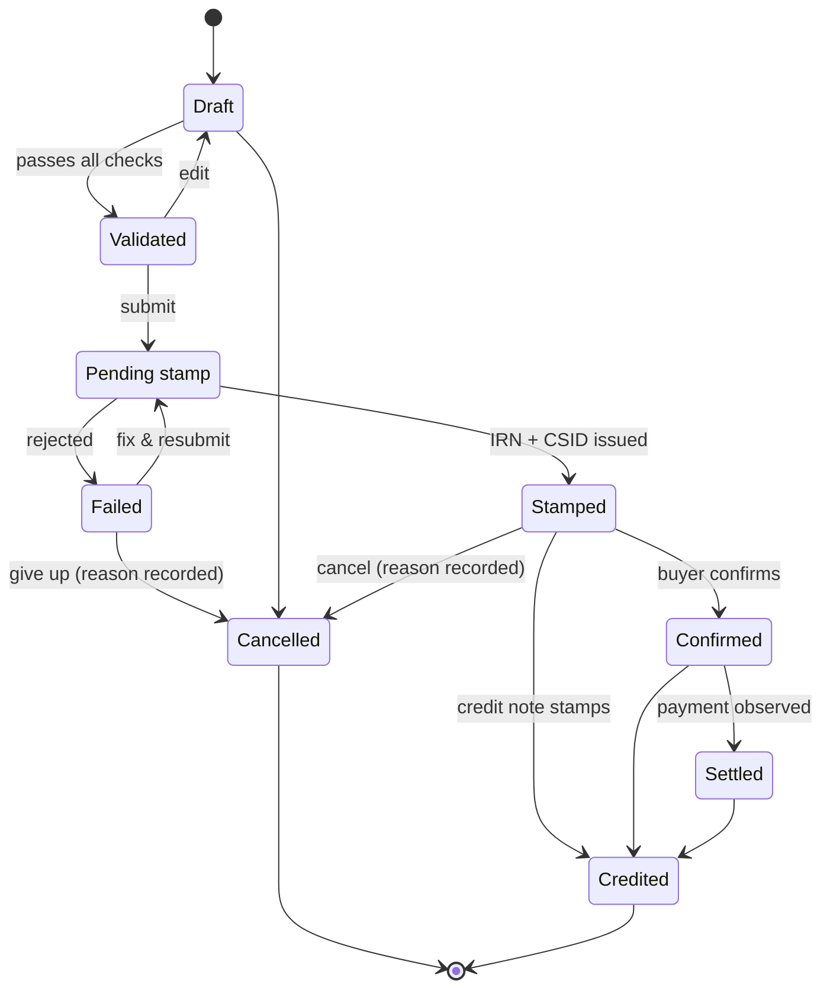

# MeridianIQ — User Manual

*One data spine. Four ways in.*

This manual explains everything MeridianIQ does and how to use it — written
for the people who use it every day (SME owners, accountants, buyer finance
teams, Compliance Desk operators, auditors) with a final section for whoever
runs the system.

---

## Contents

1. [What is MeridianIQ?](#1-what-is-meridianiq)
2. [Quick start: signing in](#2-quick-start-signing-in)
3. [Who sees what: the six account types](#3-who-sees-what-the-six-account-types)
4. [The Compliance App — for SMEs](#4-the-compliance-app--for-smes)
5. [The Accountant Console — for firms](#5-the-accountant-console--for-firms)
6. [The Compliance Desk — for operators](#6-the-compliance-desk--for-operators)
7. [Buyer Rails — for buyer finance teams](#7-buyer-rails--for-buyer-finance-teams)
8. [The Penalty Calculator — free and public](#8-the-penalty-calculator--free-and-public)
9. [The life of an invoice](#9-the-life-of-an-invoice)
10. [Feature flags: why some pages say "not yet enabled"](#10-feature-flags-why-some-pages-say-not-yet-enabled)
11. [Consent and your data](#11-consent-and-your-data)
12. [For administrators](#12-for-administrators)
13. [Troubleshooting & FAQ](#13-troubleshooting--faq)
14. [Glossary](#14-glossary)

---

## 1. What is MeridianIQ?

Nigeria's tax authority requires businesses to submit their invoices to the
national e-invoicing platform for validation **before** the buyer acts on
them. A validated invoice receives an official stamp — an IRN, a CSID and a
QR code. Missing the submission window, or submitting invoices the platform
rejects, attracts penalties.

MeridianIQ makes that painless, and then makes it worth more:

- **For SMEs** — guided invoicing that catches errors *before* submission,
  automatic transmission with retries, a permanent vault of stamped invoices,
  and deadline alerts so a penalty letter never comes as a surprise.
- **For accounting firms** — one screen showing penalty risk across the whole
  client book, plus onboarding, billing, advisory tools and white-label
  branding.
- **For big buyers** — a workflow to verify supplier invoices (protecting the
  buyer's input-VAT position) and confirm them formally.
- **Underneath it all** — every submission, confirmation and settlement is
  recorded once, immutably, with consent attached. Today that record keeps
  you compliant; one day it can make your invoices financeable.

Everything runs in one place, reached through **one front door**:

| Address | Workspace | For |
|---|---|---|
| `/` | **The Portal** — sign in, pick a workspace | Everyone |
| `/app/` | **Compliance App** | SME owners, firm staff |
| `/console/` | **Accountant Console** (incl. the Compliance Desk) | Firms, operators, auditors |
| `/buyer/` | **Buyer Rails** | Buyer finance teams |
| `/penalty-calculator/` | **Penalty Calculator** | Anyone — no account needed |

---

## 2. Quick start: signing in

### The portal

Open the site root (`/`). You'll see four workspace tiles and a **Sign in**
panel. One sign-in unlocks every workspace your account is allowed to use —
after signing in you are taken straight to your main workspace, and the tiles
you can open are highlighted.

### Demo accounts

Every demo account uses the password **`meridian2027`**. On the portal,
clicking a demo account name signs you in with one click.

| Account | Email | Signs you into |
|---|---|---|
| SME owner (Adaeze Foods) | `owner@adaezefoods.example` | Compliance App — owns the consent decisions |
| SME firm staff | `demo.staff@meridianiq.example` | Compliance App, with live demo data |
| Accountant (firm admin) | `demo.admin@meridianiq.example` | Accountant Console (and the Compliance App) |
| Compliance Desk operator | `ops@meridianiq.example` | The operator queue in the Console |
| Buyer finance (Zenith Retail) | `finance@zenithretail.example` | Buyer Rails |
| Read-only auditor | `audit@meridianiq.example` | Audit & evidence (read-only Console) |

### Signing out

Every workspace has a **Sign out** button at the bottom of its left sidebar
(next to **All apps**, which takes you back to the portal). Signing out ends
the session everywhere.

### Changing your password

On the portal, while signed in, your account card has a **Change password**
link. You must enter your current password; the new one needs at least 8
characters. The change is recorded on the audit trail.

### Security you'll notice

- Wrong email or password always produces the same message — the system never
  reveals whether an email exists.
- **Five failed attempts within 15 minutes** locks that email (from your
  network) out of sign-in until the window passes. If you see *"Too many
  sign-in attempts"*, wait the indicated time and try again.
- Sessions last 7 days, in a secure browser cookie.

---

## 3. Who sees what: the six account types

MeridianIQ enforces permissions at every level — the menus you see, the pages
you can open, and the data the server will return.

| Role | Plain-language description |
|---|---|
| **Client user** | The SME itself (e.g. the business owner). Creates and submits its own invoices, and is the account that grants or revokes **consent** over the business's data. |
| **Firm staff** | An accountant working clients' books. Everything the client can do (except consent decisions), plus firm-wide views. |
| **Firm admin** | Runs the practice. Everything staff can do, plus onboarding pipeline management, billing, white-label branding, ERP integrations and client import. |
| **Operator** | MeridianIQ's own Compliance Desk. Works a cross-tenant case queue, edits the error catalogue, manages platform health, feature flags and party data. Does **not** see firm business pages like the portfolio. |
| **Buyer user** | A finance person at a large buyer. Sees only invoices addressed to their own organisation. |
| **Auditor** | Read-only everything. Can view every screen the numbers live on, and can verify/export the audit log — but every button that would change something is absent or refused. |

If you open a page your account can't use, you get a clear card explaining
which permission it needs — never a broken screen.

---

## 4. The Compliance App — for SMEs

Sign in as the SME owner or firm staff and you land at `/app/`.

### Dashboard

Four tiles summarise the book at a glance — **Pending invoices** (submitted,
awaiting stamping), **Stamped & valid**, **Drafts**, and **At risk** — plus
recent activity.

### Creating an invoice

**Invoices → New invoice.** The guided form asks for the buyer, dates, and
line items (description, quantity, unit price, VAT rate). Totals and VAT are
computed for you.

- The form validates **everything locally before submission is even
  offered** — a missing mandatory field is flagged in plain language, naming
  the field and the fix.
- Your work is auto-saved as a draft in the browser, so a dropped connection
  never loses a half-entered invoice.

### Importing invoices in bulk

**Import** accepts the published CSV/Excel template — download it from the
page. Columns:

```
invoiceNumber, buyerName, buyerTin, issueDate, dueDate,
description, quantity, unitPrice, vatRate, currency
```

Imports up to **5,000 rows** are processed with a per-row result — every
rejected row tells you why, and nothing is half-imported silently.

### Submitting for stamping

On an invoice, **Submit for stamping** validates it and queues it for
transmission. Stamping is **asynchronous** — the national platform takes time
(the demo rail is fast; reality is measured in hours), so the invoice shows
as **Pending stamp** until the result arrives:

- **Stamped** — the invoice card shows the official **IRN** and **CSID**; the
  signed artifact is stored permanently in the vault. Done.
- **Failed** — see below.

Transmission is reliable by design: automatic retries with backoff, duplicate
protection (retrying can never create two stamps), and automatic failover to
a second transmission rail if the first is down.

### When a submission fails

A failed invoice shows a plain-language explanation drawn from the **error
catalogue**: what the rejection code means, what caused it, and how to fix
it. From there you can:

1. **Fix and resubmit** — correct the named field and submit again.
2. **Escalate to my firm** — describe what you already tried and send it. The
   escalation lands directly in the **Compliance Desk operator queue** with
   your notes attached, so nobody asks you to repeat yourself.

### Cancelling and credit notes

Mistakes after stamping are handled formally, never by editing history:

- **Cancel invoice** (available before settlement) — records a cancellation
  with your stated reason. A cancelled invoice is terminal and can never be
  presented as valid again.
- **Issue credit note** (for stamped/confirmed/settled invoices) — creates a
  credit note (numbered `CN-<original number>`) that is itself submitted and
  stamped. **When the credit note stamps, the original automatically becomes
  Credited** — a terminal state. Only one live credit note may exist per
  invoice.

Both actions require a reason, which is recorded on the permanent ledger.

### Requesting buyer confirmation

On a stamped invoice, **Request confirmation** asks your buyer to formally
confirm it inside Buyer Rails. The confirmation timeline on the invoice shows
every response (confirmed / queried / rejected). A confirmed invoice is worth
more than a stamped one — it's the buyer saying *"yes, we owe this."*

### Reconciliation *(feature-flagged)*

**Reconciliation** matches your bank statement against your stamped invoices:

1. Upload a statement export — GTBank CSV, Zenith CSV, Access CSV, or a
   generic CSV are recognised.
2. The matcher proposes matches with a confidence score.
3. **Accept** a proposal and the invoice is marked **Settled** with the bank
   line as evidence; reject and it's dropped.

This is the honest way an invoice becomes "paid" in MeridianIQ — a real,
source-tagged settlement event, never a manual tick-box.

### B2C reports *(feature-flagged)*

B2C sales above ₦50,000 must be reported within **24 hours**, with a daily
penalty for lateness. The **B2C Reports** page shows each day's batch with a
live countdown clock (`Xh Ym left to report`), the items inside it, and its
report status. Batches at risk of breaching alert you before the deadline,
not after.

### Calendar and alerts

- **Calendar** — every compliance deadline for your business: invoice
  submission windows, B2C report windows, penalty-watch items.
- **Alerts** — choose the channels (WhatsApp / SMS / email) for urgent
  alerts, and send yourself a test. Privacy rule: alert messages are
  **pointers only** — they never contain amounts, names, or documents, just
  "you have N items to review" with a link into the app.

### Consent

The **Consent** page shows the three permission layers over your business
data, each grantable and revocable **by you** (the client account):

1. **Compliance & submission** — lets MeridianIQ validate, submit, vault and
   alert. Without it, nothing can be submitted on your behalf.
2. **Anonymized benchmarking** — allows anonymized, aggregate industry
   statistics. Never shown with your name.
3. **Credit readiness** — dormant. One day your compliance history could help
   you get paid early against invoices you've already earned; that layer
   activates later, and only with your explicit consent.

Every grant and revocation is a **ledger event** with a full history —
revoking takes effect immediately.

---

## 5. The Accountant Console — for firms

Sign in as the firm admin and you land at `/console/` on the **Portfolio**.

### Portfolio

The whole client book, ranked by penalty risk:

- **High risk** (red) — overdue unsubmitted invoices, or more than one failed
  submission. Act today.
- **Medium risk** (amber) — a failure to resolve, or a submission window
  closing within 3 days.
- **Low risk** (green) — compliant.

The summary tiles show client count, high-risk count, unsubmitted invoice
value, and overdue deadlines. Click any client to drill down to their full
invoice list — a partner can reach any failing invoice in three clicks.

### Onboarding pipeline

A simple stage board for prospective clients: **lead → contacted → proposal →
onboarding → active** (or lost). Each prospect records estimated monthly
invoice volume, which powers the next view.

### Unearned income

For every eligible prospect not yet converted, this view computes the
billing and revenue share the firm is leaving on the table at current tiers —
reconciled to the naira with the billing module. It is the "why finish
onboarding" screen.

### Advisory toolkit

Two revenue-earning instruments, both writing their findings into the client
record:

- **Readiness assessment** — pick a client, answer the yes/no questionnaire
  (weighted questions across systems, records and process), and get a scored
  gap report (`ready / partial / at_risk`) with a prioritised remediation
  plan.
- **VAT-risk check** — paste a buyer's supplier ledger as CSV (columns are
  matched loosely: invoice number, supplier TIN, supplier name, IRN, CSID,
  invoice amount, VAT amount). Every row's stamp is verified against the
  national system, and the report totals the **input VAT at risk** from
  invalid supplier invoices.

### Plans & billing

The four commercial tiers, with per-tier pricing, included invoice volume,
overage price and revenue-share percentage:

| Tier | Monthly | Included invoices | Overage | Revenue share |
|---|---|---|---|---|
| Essential | ₦15,000 | 50 | ₦120 | 10% |
| Compliance Desk | ₦45,000 | 200 | ₦100 | 15% |
| Professional | ₦120,000 | 750 | ₦80 | 20% |
| Enterprise-lite | ₦350,000 | 3,000 | ₦55 | 25% |

Firm admins can change the firm's subscription and edit tier parameters —
every price change is recorded as a **price review** with history, not a
silent overwrite.

### Statements

Monthly revenue-share statements per firm: billed invoice count, subscription
+ overage, and the firm's share. Generate a period on demand and **export
CSV** for accounting.

### Client import *(feature-flagged)*

Bulk-import a client book from a practice-management export — a 200-client
book lands in one session, with per-row results.

### Integrations *(feature-flagged)*

Connect a client's accounting package (SagePro and QuickLite ship first) and
pull their AR invoices on demand. **Sync now** imports through the standard
path — validation still runs before anything is submitted. The page shows
each connection's status, last sync and any errors.

### White-label *(feature-flagged)*

Brand the workspace as your own: firm name, colours and a subdomain — live in
under a day, no per-firm deployment.

### Certification

CPD course content for firm staff: enrol in a course, work through its
modules, and complete it for the stated CPD hours. Progress per person is
tracked (enrolled / completed).

---

## 6. The Compliance Desk — for operators

Sign in as the operator and the console becomes the **Compliance Desk**: the
firm business pages disappear and the platform-operations pages appear. You
land directly on the queue.

### Operator queue

The heart of the managed service. Cases arrive here automatically from three
sources — no one has to file them:

1. **Client escalations** — when an SME clicks *Escalate*, the case appears
   with the client's own words attached ("what I already tried").
2. **Failed submissions** — when the pipeline gives up on an invoice
   (terminal rejection or exhausted retries), a case opens with the failure
   code.
3. **Unmapped error codes** — when a failure code appears that the error
   catalogue doesn't know, a case opens asking for a catalogue entry
   (within about a minute of the first sighting).

Each case card shows the firm, client and invoice, the priority, the
**playbook** for its error code (cause + fix from the catalogue), and any
client escalation context. The workflow:

- **Claim case** — takes it; the clock starts.
- **Retry & resolve** — for retriable errors, one click.
- **Resolve** — with an optional resolution note.

The stat tiles across the top — open, in progress, resolved, **clients
served**, **average handle time** — are the Desk's operating numbers. One
open case per invoice: repeat signals raise its priority instead of
duplicating it.

### Error catalogue

The living knowledge base behind every "here's what went wrong" message in
the product. Operators can search it, edit any entry's cause/fix/category,
mark codes retriable, and add new codes. A banner lists **unmapped codes**
seen on real submissions — one click pre-fills a new entry for them. Keep
this current and most failures resolve themselves without the Desk.

### Party integrity

Clean counterparty data, which everything downstream depends on:

- **Duplicate candidates** — parties sharing a TIN or a near-identical name,
  grouped. Pick the surviving record and **merge**; history is preserved
  (nothing is deleted) and a wrong merge can be **split back out**.
- **TIN validation** — parties without a validated TIN are listed; they
  cannot enter the confirmation workflow until fixed.

### Platform ops

Live health of the machinery:

- **Submission rails** — each transmission rail's circuit-breaker state
  (Healthy / Half-open / Circuit open) and recent failure count.
- **Dead-lettered events** — queued work the pipeline gave up on, with the
  error and a **Replay** button.
- **Reconcile pipeline** — one click re-queues anything stuck.
- **Message deliveries** — every outbound alert (template, channel, failover,
  delivery status). Appears once notifications are switched on.

### Gate metrics

The roadmap's release gates, measured live from real data: subscribed firms,
median time-to-stamp (target: under 48 hours), failure self-resolution rate
(target: 80%+ without escalation), credit-observable businesses (tracking to
300), confirmations per 30 days, reconciliation accept rate. Releases unlock
on evidence — this page **is** the evidence.

### Feature flags

Every release-gated capability, grouped by release (R0–R4), each with a
switch. Turning a flag on makes its surface live for every firm instantly;
off makes it unreachable (the pages answer "not yet enabled"). Only the
operator can flip flags — firm admins see this page read-only.

### Audit & evidence

The tamper-evident audit log, live:

- **Chain verified** — every recorded event hash-chains to the previous one;
  altering or deleting any row would break every link after it, and this page
  proves the chain end-to-end on demand.
- **Download audit bundle** — a self-contained export (all events + the
  verification result) that a regulator, bank or acquirer can re-verify
  independently.

---

## 7. Buyer Rails — for buyer finance teams

Sign in as a buyer and you land at `/buyer/`. *(Feature-flagged — the
operator switches Buyer Rails on.)* A buyer account sees **only invoices
addressed to its own organisation**.

### Confirmations

The queue of supplier invoices awaiting your response. Open one and choose:

- **Confirm** — "we received this and it is correct." Optionally tick the
  **no-set-off acknowledgment** (a formal statement that you won't offset
  this invoice against counterclaims — which is what makes it financeable
  later).
- **Query** — send it back with a question; the supplier can correct and
  re-request.
- **Reject** — with the reason recorded.

Every response records who confirmed and how, permanently. Confirming is in
your own interest: your input-VAT claim rests on valid supplier invoices.

### Suppliers

Continuous verification across your supplier base: which suppliers' invoices
carry valid stamps, and your **input-VAT exposure** from ones that don't —
refreshed daily.

### Scoreboard

Your suppliers ranked by compliance and confirmation status — exportable for
procurement conversations.

### Payment flags

Mark an invoice **scheduled** or **paid**. A payment flag becomes a
settlement event on the supplier's record within a minute — the second
honest source (after bank-statement matching) of "this invoice was paid."

---

## 8. The Penalty Calculator — free and public

`/penalty-calculator/` needs no account and sends nothing to any server —
everything computes in your browser. Enter your annual turnover and
non-compliance inputs and it estimates exposure under:

- **s.103** — failure to grant systems access (a first-day amount plus a
  per-additional-day amount, banded by turnover), and
- **s.104** — non-compliant electronic invoices (a per-invoice amount, banded
  by turnover).

Use it as the "how bad could this get?" conversation starter.

---

## 9. The life of an invoice

Everything in MeridianIQ hangs off one idea: **an invoice's history is
append-only.** Drafts are editable; from submission onward nothing is ever
edited or deleted — states are only ever *added*. That's what makes the vault,
the audit trail and (one day) financing trustworthy.



What the states mean in practice:

| State | Meaning |
|---|---|
| **Draft** | Editable working copy. The only mutable state. |
| **Validated** | Passed every mandatory-field check locally; ready to submit. |
| **Submitted / Pending** | In the pipeline / awaiting the national platform's verdict. |
| **Stamped** | Officially valid — IRN, CSID and QR recorded; artifact vaulted forever. |
| **Failed** | Rejected, with a catalogue explanation. Fix and resubmit, or cancel. |
| **Confirmed** | The buyer formally acknowledged it in Buyer Rails. |
| **Settled** | Payment was *observed* — a statement match or a buyer payment flag. Never a manual tick. |
| **Cancelled** | Terminal. Never presentable as valid again. |
| **Credited** | Terminal. A stamped credit note reversed it — reached **only** through a stamped credit note. |

The public **stamp verification** service reflects this: verifying a
cancelled or credited invoice's stamp reports it as valid-but-**not
eligible**, so a dead invoice can never be passed off as a live one.

---

## 10. Feature flags: why some pages say "not yet enabled"

MeridianIQ ships capabilities **dark** and switches them on when their
evidence gate passes (or per firm). A dark feature isn't hidden — it's
unreachable, for every role. If a page shows *"…is not yet enabled"*, ask
your operator to flip its flag (Compliance Desk → Feature flags).

| Flag | Release | What it unlocks | Ships |
|---|---|---|---|
| `invoice_lifecycle` | R0 | Core invoicing | **On** |
| `advisory_engagements` | R0 | Advisory toolkit | **On** |
| `consent_ledger` | R0 | Consent ledger | **On** |
| `buyer_confirmations` | R1 | Confirmation workflow | **On** |
| `stamp_verification` | R1 | Public stamp verification | **On** |
| `messaging_notifications` | R1 | WhatsApp/SMS/email alerts + delivery log | Dark |
| `anonymized_benchmarks` | R2 | Aggregate analytics | Dark |
| `reconciliation` | R2 | Bank-statement reconciliation | Dark |
| `b2c_reporting` | R2 | B2C 24-hour reports | Dark |
| `buyer_rails` | R2 | The whole Buyer Rails portal | Dark |
| `white_label` | R2 | Theming, subdomains, client import, certification | Dark |
| `erp_connectors` | R2 | ERP integrations | Dark |
| `credit_readiness` | R3 | Credit layer (dormant by design) | Dark |
| `bank_data_room` | R4 | Bank data room (dormant by design) | Dark |

R3/R4 flags stay dark until their business gates pass — that's policy, not an
oversight.

---

## 11. Consent and your data

Three principles, visible throughout the product:

1. **Consent is layered and owned by the client.** Layer 1 (compliance) is
   what lets anything be submitted at all; layer 2 (anonymized benchmarking)
   is optional; layer 3 (credit) is dormant until it's real — and every code
   path that would use client data beyond layer 1 checks the ledger first.
   Revocation takes effect immediately.
2. **Alerts never carry data.** A WhatsApp/SMS/email alert says *how many*
   items need attention and links into the authenticated app — never amounts,
   names, TINs or documents.
3. **History is evidence.** The audit log is hash-chained and exportable;
   invoice lifecycles are append-only; merged party records keep their
   lineage. Nothing is silently edited.

---

## 12. For administrators

### Running the platform

Requirements: Node.js 22+, pnpm 10, PostgreSQL, and a `DATABASE_URL`
environment variable.

```bash
pnpm install                                        # dependencies
pnpm --filter @workspace/db run push                # create/update tables
pnpm --filter @workspace/api-server run dev         # API server on :5000
pnpm run typecheck                                  # full typecheck
pnpm --filter @workspace/api-server run test        # unit tests (no DB needed)
pnpm --filter @workspace/db run test                # migration rollback test (needs DB)
pnpm --filter @workspace/api-spec run codegen       # regenerate API clients after editing openapi.yaml
```

On boot the server applies its guardrail migrations (append-only triggers,
row-level security, retention) and **seeds** the demo tenant: flags, demo
firm and clients, all six demo accounts, invoices in every lifecycle state,
operator cases, billing tiers, CPD content. Seeding is idempotent — restarts
never duplicate data.

### The frontends

Each app is a Vite build configured by `BASE_PATH` (its path prefix) and
served under one origin: landing at `/`, console at `/console/`, SME app at
`/app/`, buyer portal at `/buyer/`, penalty calculator at
`/penalty-calculator/`. In production each build has SPA rewrites, so deep
links work.

### Quality gates (CI)

`.github/workflows/ci.yml` runs two jobs on every pull request:

- **quality-gate** — typecheck, unit tests, a codegen-drift check (the
  committed API clients must match `openapi.yaml`), the migration
  rollback test against a real Postgres, and all four production builds.
- **e2e** — boots the built API server and built frontends behind a
  path-router and drives **21 headless user-journey checks** (auth incl.
  throttling and password change, the operator Desk, admin advisory, the
  auditor's read-only boundary, consent round-trip, and the credit-note
  lifecycle) against a freshly seeded database.

Run the E2E suite locally with a scratch database:

```bash
DATABASE_URL=postgres://... pnpm --filter @workspace/scripts run e2e
# prerequisites: build api-server + the four frontends (see scripts/src/e2e/run.mjs)
```

### Security posture (summary)

- Row-level security pins every firm-scoped query to its tenant **in the
  database**, not just in code; cross-tenant staff (operator/auditor) and
  buyer principals are scoped at the route level.
- Post-submission invoice records are protected by append-only DB triggers.
- The audit log is hash-chained; the chain is verifiable in-app and on
  export.
- Login is throttled (5 failures / 15 min per email+network); passwords are
  scrypt-hashed; sessions are HMAC-signed HttpOnly cookies (7 days).
- Alert messages are pointer-only by construction — the template registry
  cannot carry data fields.
- Demo/dev header identities are honoured only outside production; production
  identity is Clerk (which is also where MFA belongs).

### Resetting demo data

Lifecycle tables are append-only and refuse UPDATE/DELETE by trigger. To
reset a demo database, `TRUNCATE ... CASCADE` the tables (or drop and
recreate the database) and restart the server — never row-by-row DELETE.

---

## 13. Troubleshooting & FAQ

**"Signed in as … This workspace needs a … account."**
That workspace isn't for your role — e.g. a buyer opening the console. Use
**Back to the MeridianIQ portal** and pick a highlighted tile.

**"… is not yet enabled" on Reconciliation / B2C / Buyer Rails / Integrations / White-label.**
The feature's flag is dark. An operator can flip it: Compliance Desk →
Feature flags. See [section 10](#10-feature-flags-why-some-pages-say-not-yet-enabled).

**"Too many sign-in attempts."**
Five failed passwords within 15 minutes locks sign-in for that email from
your network. Wait for the window shown in the message.

**"Account has no active membership."**
The account exists but has no workspace role yet — an administrator needs to
add its membership.

**A credit note fails with "supplier.street — …" (or another named field).**
Credit notes are stamped documents, so they must pass full validation — and
they inherit the client's party record. Complete the named field on the
client (and ensure layer-1 consent is granted), then retry.

**"Only a stamped, confirmed or settled invoice can be adjusted" / "already has an active adjustment."**
Credit notes only apply after stamping, and only one live credit note may
exist per invoice. Cancel the failed/stale adjustment first if you need to
reissue.

**The operator can't see the Portfolio.**
By design — the Compliance Desk works cases across all firms but doesn't
browse any single firm's business pages. Firm data belongs to firm roles.

**An invoice is stuck in "Pending stamp."**
The demo rail stamps within seconds; if something ever wedges, the Desk's
**Platform ops → Reconcile pipeline** re-queues stuck work, and dead-lettered
events can be replayed there.

**I clicked a demo account but nothing happened.**
The one-click sign-in navigates you to that account's workspace — check the
address bar; if you were already signed in, sign out first (the panel shows
who is signed in).

**Where do escalations go?**
Straight into the operator queue as a case, with your notes attached. There
is no separate inbox to check.

---

## 14. Glossary

| Term | Meaning |
|---|---|
| **IRN** | Invoice Reference Number — the national platform's identifier for a validated invoice. |
| **CSID** | Cryptographic Stamp ID — the platform's stamp proving validation. |
| **Stamp** | The IRN + CSID + QR issued when the national platform accepts an invoice. |
| **TIN** | Tax Identification Number of a business. Validated TINs gate the confirmation workflow. |
| **CAC number** | Corporate Affairs Commission registration number. |
| **APP / rail** | Access Point Provider — the accredited channel that transmits invoices to the authority. MeridianIQ uses two, with automatic failover. |
| **Vault** | Permanent, write-once storage of stamped invoice artifacts. |
| **Error catalogue** | The living map from every rejection code to a plain-language cause and fix. |
| **Escalation** | A client's "I'm stuck" — lands in the operator queue with context. |
| **Case** | A unit of Compliance Desk work: an escalation, a dead-lettered failure, or an unmapped code. |
| **Confirmation** | A buyer's formal acknowledgment of an invoice in Buyer Rails. |
| **No-set-off** | The buyer's acknowledgment that it won't offset the invoice against counterclaims. |
| **Settlement event** | Evidence an invoice was paid, from an allowed source: statement match, buyer flag, or (later) a collection-account feed. |
| **Credit note** | A stamped document that formally reverses an invoice; the only way an invoice becomes **Credited**. |
| **Consent layer** | One of three permission tiers over client data: compliance, benchmarking, credit. |
| **Feature flag** | The switch that keeps a release-gated capability dark until its evidence gate passes. |
| **Credit-observable** | A business whose stamped invoices flow through the platform with confirmation or settlement signals — the measure the credit roadmap gates on. |
| **s.103 / s.104** | The statutory penalty sections for denying systems access / issuing non-compliant e-invoices. |
| **Audit bundle** | A self-contained, independently verifiable export of the hash-chained audit log. |
