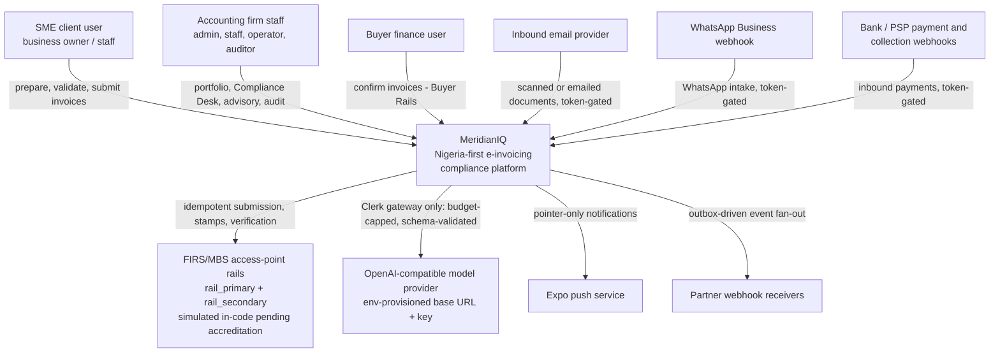
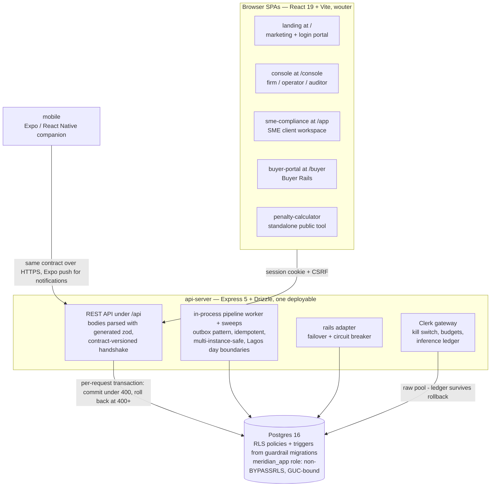

# MeridianIQ — architecture guidebook

The visual maps and the decision log: the two things `docs/platform.md` and
`docs/clerk-ai.md` (deep prose) and `CLAUDE.md` (the lean index) don't carry.
Level of detail follows the C4 idea — context first, then containers; the
component story is told by the code itself (`artifacts/api-server/src/modules/`
is packaged by component, one directory per responsibility).

This document is kept honest by
`artifacts/api-server/src/architecture-conformance.test.ts`: every workspace
package must be named here, and the structural sections below must exist.
Adding a package or making a significant decision means updating this file in
the same change — the suite fails otherwise.

## Context — MeridianIQ and its world

Reading notes, in the order the diagram surprises people:

- **The rails are simulated.** `modules/rails/adapter.ts` presents one adapter
  interface over two accredited access-point rails and exercises the full
  contract (idempotent submission, deterministic sandbox stamps, verification,
  failover, circuit breaker) without a real MBS/APP endpoint. Accreditation
  swaps the adapter internals; callers don't change. Every diagram of this
  system that omits the word "simulated" is lying.
- **Every machine rail fails closed.** The inbound email, WhatsApp and
  payment/collection webhooks are token-governed: token unset means the rail
  is dark, not open.
- **The model provider is reachable from exactly one place** — the Clerk
  gateway (`modules/clerk/gateway.ts`): kill switch, per-firm monthly budget
  checked before the provider is touched, append-only inference ledger,
  schema-validated output, fail closed.
- **Outbound content is pointer-only** (SEC-12) and consent-gated (CORE-03):
  push and messaging templates never carry amounts, names or TINs.

## Containers — what actually runs

- The api-server **serves the five web bundles itself** at their `BASE_PATH`
  prefixes — one origin, one session cookie, one deploy. `info.version` from
  the contract is baked into server and bundles; `/api/healthz` returns the
  server's copy and the apps show a stale-build banner on mismatch.
- **The RLS boundary is the tenancy model.** Every request runs as the
  non-BYPASSRLS `meridian_app` role inside a per-request transaction with
  `app.firm_id`/`app.bypass` GUCs bound to the principal. Firm isolation is a
  database property; sibling-**client** isolation inside a firm is not (see
  D2 and SEC-03 in `CLAUDE.md`).
- **There is no external queue.** Background work is the in-process pipeline
  worker plus registered sweeps over an outbox table (see D1).

## Workspace packages

Runtime containers above; everything else is build-time. The conformance test
requires every package named here.

| Package | What it is |
|---|---|
| `@workspace/api-server` | Express 5 + Drizzle data spine and rails (the one deployable). |
| `@workspace/landing` | Marketing site + login portal at `/`. |
| `@workspace/console` | Firm/operator/auditor web app at `/console`. |
| `@workspace/sme-compliance` | SME client web app at `/app`. |
| `@workspace/buyer-portal` | Buyer Rails web app at `/buyer`. |
| `@workspace/penalty-calculator` | Standalone public tool. |
| `@workspace/mobile` | Expo / React Native companion. |
| `@workspace/db` | Drizzle schema, guardrail migrations, RLS context helpers. |
| `@workspace/api-spec` | `openapi.yaml` — THE contract — plus codegen (orval). |
| `@workspace/api-zod` | GENERATED request/response zod. Never hand-edit. |
| `@workspace/api-client-react` | GENERATED react-query hooks. Never hand-edit. |
| `@workspace/format` | Shared formatting (naira, dates, WHT copy). |
| `@workspace/api-errors` | Shared error envelope helpers. |
| `@workspace/web-ui` | Shared workspace UI (command menu, metrics, shortcuts, recents). |
| `@workspace/web-config` | Shared Vite config for the five web apps. |
| `@workspace/integrations-openai-ai-server` | The provisioned OpenAI-compatible client (base URL + key from env); imported only by `modules/clerk/provider.ts`, the gateway's provider layer. |
| `@workspace/scripts` | e2e harness (Playwright), ux-snapshot, ops (backup/restore drill). |

## Decision log

Significance measured by cost of change: these are the decisions you cannot
refactor in an afternoon. Format: context → decision → consequences. New
significant decisions get an entry here in the same change that makes them.

### D1 — One deployable, in-process worker, no external queue

Context: background work (submission pipeline, verification, digests, sweeps)
needs ordering, retries and multi-instance safety; the team is small and the
deployment target (Replit workflow) is a single Node process that may scale
sideways.
Decision: a monolith with an in-process pipeline worker and registered sweeps
draining an **outbox table**, idempotent and multi-instance-safe, with Lagos
day boundaries computed in SQL.
Consequences: no broker to operate; every sweep must be written idempotently;
horizontal scale is safe but work sharding is coarse. Moving to a real queue
later is an adapter swap around the outbox, not a rewrite.

### D2 — Firm-keyed RLS with GUC-bound per-request transactions

Context: multi-tenant isolation for accounting firms had three candidate
shapes: schema-per-tenant, app-layer filtering only, or row-level security.
Decision: one schema, Postgres RLS enforced for the non-BYPASSRLS
`meridian_app` role, with `app.firm_id`/`app.bypass` GUCs bound per request
inside a transaction (`tenantContext`).
Consequences: firm isolation is a database property that survives application
bugs. But RLS shares a firm across all its `client_user`s, so sibling-client
isolation (SEC-03) must ALSO be asserted in routes
(`assertClientPartyScope`/`clientPartyScope`) — RLS is not a backstop there.
Tests need the guardrail migrations applied or they hit permission-denied.

### D3 — The 4xx rollback rule (and the raw-pool exception)

Context: handlers that partially wrote and then errored were leaving
half-states behind.
Decision: `tenantContext` buffers the response and commits only when
`status < 400`; anything at 400+ rolls the whole request back.
Consequences: handlers are atomic by default. Anything that must persist even
when the handler fails — login throttle counters, the Clerk inference ledger
(spend accounting must survive any rollback) — must write on the **raw
`pool`**, never `getDb()`. That exception list is small and deliberate.

### D4 — Contract-first with generated clients and a build handshake

Context: five web apps and a mobile app against one API; drift between server
parsing and client expectations is the classic failure.
Decision: `lib/api-spec/openapi.yaml` is the source of truth. Codegen produces
`api-zod` (the server parses every body/query/params with it) and
`api-client-react` (the apps call only these hooks); CI fails on any drift.
`info.version` is baked into server and bundles as a build handshake with a
stale-build banner.
Consequences: contract changes are one edit + regeneration; hand-editing
generated packages is forbidden; every contract change bumps the version.

### D5 — Two-channel schema management: `drizzle push` + guardrail migrations

Context: drizzle push is convenient for tables but cannot express RLS
policies, triggers, or FORCE ROW LEVEL SECURITY.
Decision: tables come from `drizzle push`; RLS policies/triggers come from
numbered guardrail migrations in `lib/db/src/migrations` with rollback tests.
Consequences: a new tenant table is not done until its policy migration
exists; scratch databases need push THEN migrate, in that order; production
table changes are applied by the release procedure, while every production
boot applies the hand-written guardrail migrations idempotently under an
advisory lock and then verifies coverage before readiness. The manual
`@workspace/db migrate` command remains the pre-deploy/recovery path; boot is
the fail-closed safety net for RLS, trigger, and index guardrails that Publish
cannot express.

### D6 — Prefix-mounted SPAs on one origin

Context: five separate frontends could each have had their own host.
Decision: every bundle builds with a `BASE_PATH` and the api-server serves
them all from one origin (`/`, `/console`, `/app`, `/buyer`,
`/penalty-calculator`).
Consequences: one session cookie, no CORS surface, one deploy and one
version-skew story; the cost is that a server restart is required for any
bundle to ship (see `CLAUDE.md` deployment notes) and per-app CDN routing is
off the table for now.

### D7 — One rails adapter, simulated until accredited

Context: FIRS/MBS access-point accreditation is pending, but the whole
lifecycle (submit → stamp → verify) had to be real for users and tests.
Decision: a single adapter interface over two simulated rails with
deterministic canonical-payload-derived stamps, idempotent submission,
failover and a circuit breaker.
Consequences: the platform's callers, tests and UI are already shaped for the
real thing; accreditation is an adapter-internal change. The word "simulated"
must travel with every architecture claim until then.

### D8 — Clerk gateway as the single model choke point

Context: an AI assistant touching financial records needs auditable spend,
provable grounding and an off switch.
Decision: every model call flows through `modules/clerk/gateway.ts`: `clerk_ai`
kill switch, per-firm monthly token budget checked before the provider and
again in the gateway, append-only inference ledger on the raw pool,
schema-validated output, fail closed. Facts are computed in SQL; the model
only classifies or phrases; a deterministic template fallback always answers.
Consequences: no feature may import the provider client directly
(`integrations-openai-ai-server` is imported only by the gateway's provider
layer, `modules/clerk/provider.ts`); model outages degrade to templates
instead of errors; spend is accountable per firm.

### D9 — Launch posture as a flag manifest with per-route gates

Context: launching with the full surface lit was too much risk; env-var flags
rot and can't express "dev-lit, launch-dark".
Decision: a `RELEASE_FLAGS` manifest (`modules/flags/releases.ts`) with
`launchDefault`/`devDefault` per flag, enforced by per-route `requireFlag`
gates (never whole-router `router.use` — routers mount prefix-less, so a
router-level gate intercepts unrelated routes), surfaced to clients via
`Me.features`, and pinned by a posture test that counts gates per file.
Consequences: a fresh production database lights exactly the R0 core; turning
a feature on is a deliberate manifest + posture-test change; client nav hides
what the API would 404.

### D10 — Fail-closed machine rails, pointer-only outbound

Context: webhooks and notifications are the two places data walks in or out
without a human session.
Decision: inbound rails (email, WhatsApp, payments/collections) are dark
unless their token is configured; outbound messages and push notifications
are consent-gated (CORE-03) and pointer-only (SEC-12) — template copy plus an
opaque reference, never amounts, names or TINs.
Consequences: a misconfigured deployment leaks nothing and receives nothing;
notification depth is limited by design (the app is the place to read
details).

### D11 — Statutory time lives in SQL on the Lagos calendar

Context: deadlines, months and "overdue" are legal facts; computing them in
JavaScript across processes invites boundary bugs.
Decision: statutory clocks (VAT months, filing deadlines, day boundaries) are
computed in SQL against the Lagos calendar, and every derived figure the UI
shows states its basis.
Consequences: one source of truth for "what day is it"; UI code formats but
never re-derives statutory state; tests pin the boundary behaviour.

### D12 — Per-staff client assignment narrows the view, never the boundary

Context: the console shows every firm user the whole portfolio. The staff
workspace design (September 2026 mockups) assumes "my clients"; firms with
more than a few staff want that partition, but the launch-profile firms are
small and RLS is keyed on the firm, not the person.
Decision: add a firm-scoped assignment table (staff user ↔ client party) in
its own round. Unassigned clients stay visible to everyone (default-open);
assignment drives the default "My clients" filter and the work queue, and
firm admins always see everything. It is a convenience partition, not a
security boundary — RLS (D2) and SEC-03 remain the only isolation.
Consequences: no change to RBAC capabilities or RLS policies beyond the new
tenant table's own policy migration; assignment changes are audited like
any other firm action; the staff workspace gains a "My clients / All
clients" switch rather than a second portfolio page.

### D13 — One session is one workspace; the header chip is a label

Context: the SME mockups show a business switcher in the header. A
`client_user` is scoped to one `clientPartyId` at sign-in (the SEC-03 scope
is a property of the principal, not of a UI selection), and firm users reach
a client through the console.
Decision: no multi-business switcher. The header chip names the workspace
(`Me.workspaceName`: the client business, else the firm) and does not
switch it. An owner of several businesses gets one invitation per business.
Consequences: SEC-03 stays a one-line predicate; the SPA cannot serve one
client's cached queries under another; if a switcher is ever built it is a
re-authentication (a new session), never a client-side filter.

### D14 — No SSO in the launch window; access review as reporting, later

Context: the team-and-access mockup shows SSO and periodic access reviews.
Launch firms are Nigerian SME practices whose identity posture is the local
password plus TOTP (`TOTP_REQUIRED_ROLES`), and the platform has a single
auth code path.
Decision: no SAML/OIDC federation before the credit-perimeter releases. An
access review is a small later round built on what exists — an exportable
"who has access, since when, last sign-in" register plus a firm-admin
attestation recorded on the audit chain — scheduled after D12 so it can
report assignments too.
Consequences: one identity path to test and rate-limit; MFA enforcement stays
environment-driven; the review round is reporting and attestation only, and
must not grow an identity-provider dependency.

### D15 — Consent capture gates the first landing; Consent stays in the nav

Context: CORE-03 makes recorded consent the basis for anything the platform
sends, but the consent ledger is a page an owner may never open. The
onboarding mockup captures consent at first login. Layer 3 (data sharing)
has no live rail until the R2 releases.
Decision: after activation, the first landing shows a one-time, resumable
consent step before the workspace — layers 1 and 2 as explicit choices,
layer 3 visible but dormant ("not yet available") so it is never a silent
default. Declining is allowed and recorded. The Consent page keeps its
first-class nav entry so decisions can be revisited. Built as its own round
(a contract change to expose "consent captured" and the landing
interstitial).
Consequences: outbound rails find a consent record from day one; the
interstitial can never block a returning user (one-time by design); layer 3
copy must not promise a rail that is dark.
Status: shipped in R71 — `Me.consentCaptured` (an explicit layer-1 decision
exists, grant or recorded decline), the SME app's `RequireConsentCapture`
gate and its `first_landing` consent events.

### D16 — The design system is a refresh of the existing shell, not new apps

Context: ten screen mockups (September 2026) proposed a new visual language
for the SME, console, operator, auditor and onboarding surfaces. Verifying
them against the code showed most of their structure already exists; what
differed was palette, typography, the shell, and a handful of navigation
calls.
Decision: adopt the mockups as tokens plus shell. `@workspace/web-ui` owns
the `--mi-*` palette, the metric tiles and the `.mi-sidebar` / `.mi-topbar`
classes; sme-compliance and console render their sidebars and headers on
those classes and retone their theme variables to match. Buyer portal keeps
its own blue. Page bodies are restyled incrementally, one round at a time,
against screenshots and the accessibility check. Navigation calls made with
the shell: the SME home is "Today" (not "Dashboard"); Help sits in the
header and the sidebar footer; the stamped-invoice vault is the Invoices
list filtered to Stamped, not a separate entry; the Control centre stays in
the operator nav; the auditor badge reads "Read-only auditor"; the Release
badge is derived from `Me.releaseTag` — the highest release whose every flag
at that tag and below is lit (R0 floor), computed by
`activationReleaseTag` from the flag manifest — never hard-coded.
Consequences: a palette change lands in every app at once; the release badge
cannot drift from the activation posture (D9); remaining page-level
differences from the mockups are tracked in the UX backlog rather than
rebuilt wholesale; D12–D15 are the product decisions those screens forced,
each with its own round.
